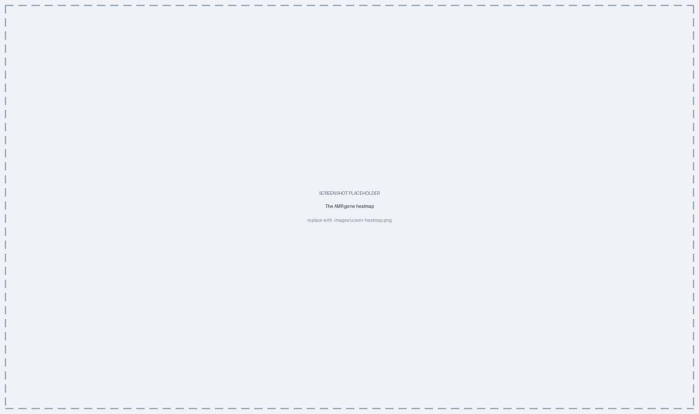
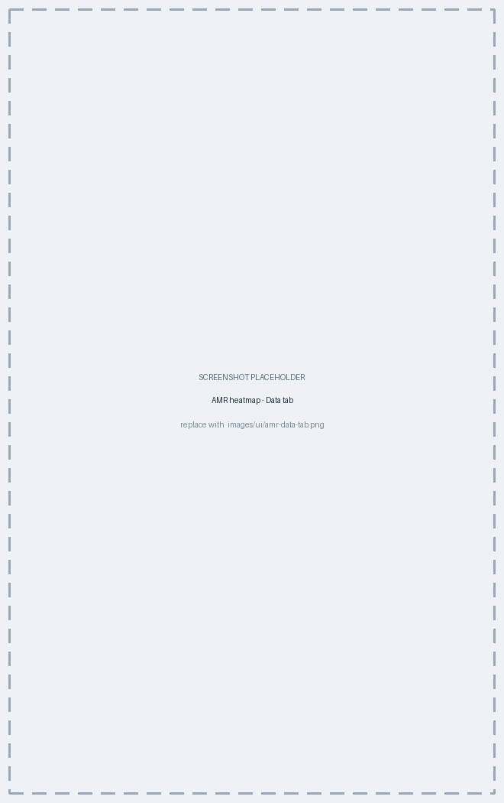

# AMR Heatmaps {#sec-amr-heatmap}

The AMR plot type reads back the findings of the resistance screen (@sec-amr) and
turns them into presence/absence and drug-class views across a collection. This
chapter covers the three views, how to organise them, and what each one is good
for.

## Local isolates only {#sec-amr-hm-scope}

Like the map and the epi curve, this plot type involves no pairwise comparison,
so its controls take effect live (@sec-viz-generate). It shows only isolates
typed in *this* database: a partner's staged profile table carries allele
identifiers and nothing else, so no AMR screen exists for those isolates
(@sec-interop-staging).

## Three views {#sec-amr-hm-views}

**Data > View** is the control that switches between them, and — like the map's
mode picker — it changes which of the other controls apply.

| View | What it shows | Use it for |
|---|---|---|
| **Gene heatmap** | Isolates × individual genes, present or absent | Seeing exactly which determinants each isolate carries |
| **Drug classes** | Isolates × drug class, with call confidence | Summarising a collection's resistance profile |
| **Prevalence** | Bars for the most common genes or classes | A quick overview of what dominates the collection |

{#fig-ui-amr-heatmap}

In **Prevalence**, two more controls appear: **Count by**, which switches the bars
between **Genes** and **Drug classes**, and **Show top**, which limits how many
are drawn (30 by default).

::: {.callout-important title="Confidence is preserved in the drug-class matrix"}
The drug-class view distinguishes a confident **match** from a **partial** call by
colour — both have their own swatch under **Colors** — and where several hits
fall in the same cell the more confident one is shown. Reading a partial as
confident would overstate an isolate's resistance, which is exactly the mistake
the matrix is designed to prevent (@sec-amr-results).

Which of these categories are drawn at all is up to you: **Data > Elements > Call
sections** ticks matches, partials and virulence groups independently.
:::

## Filtering which hits are drawn {#sec-amr-hm-filter}

For the gene heatmap and gene-level prevalence bars, **Data > Elements** decides
what reaches the plot:

| Control | Effect |
|---|---|
| **Element types** | Restrict to AMR, virulence or stress elements |
| The gene picker | Restrict to named genes, grouped by drug class |
| **Minimum % identity** | Drop hits below this identity to their reference |
| **Minimum % coverage** | Drop hits covering less than this share of it |

{#fig-ui-amr-data}

::: {.callout-important title="Raising the thresholds changes what 'absent' means"}
Both sliders start at 0, so by default every hit the screen reported is drawn.
Raising them is a legitimate way to show only high-confidence calls — but it makes
the heatmap's empty cells mean "not detected **at this threshold**" rather than
"not detected", and nothing on the figure says so. If you tighten them, say so in
the legend.

Point mutations report neither percentage and are never removed by these sliders.
:::

## Organising the columns {#sec-amr-hm-organise}

**Layout > Clustering > Group genes by** offers four arrangements — **Element
type** (the default), **Drug class**, **Cluster** and **None**. Grouping and
clustering share one control because they cannot both apply to the same axis:
grouping splits the columns into labelled blocks, clustering orders them by
co-occurrence under a dendrogram. Grouping by drug class is usually the more
readable choice for a report; clustering is the more informative one when you are
looking for co-carried elements, since genes that travel together on the same
mobile element cluster together. (The drug-class matrix has no per-gene metadata,
so it offers only **Cluster** and **None**.)

**Cluster isolates** does the same for the rows, and the **Distance** and
**Linkage** pickers beside it choose the method — *binary* distance with *average*
linkage by default, which is the standard choice for presence/absence data. Two
sliders set how much space each dendrogram gets, in centimetres.

**Annotation** adds the strips beside and above the matrix: a metadata field or
custom variable of your choice for the rows (@sec-viz-mapping), and, on the gene
heatmap, a **drug-class strip** above the columns showing which class each gene
belongs to. So a gene heatmap can show ward or origin alongside the genotype, and
a co-carriage pattern that follows one ward becomes visible immediately.

```{mermaid}
%%| label: fig-amr-hm
%%| fig-cap: "The AMR plot type reads the two views of the screen's output into three figures."
flowchart LR
  R[("Detailed findings<br/>(per element)")] --> H1["Gene heatmap<br/>isolates × genes"]
  S[("Curated summary<br/>(per drug class)")] --> H2["Drug-class matrix<br/>isolates × class"]
  R --> H3["Prevalence bars"]
  S --> H3
```

::: {.callout-important title="Absence in a heatmap is absence of a *finding*"}
An empty cell means the screen did not detect that determinant in that isolate —
not that the isolate is susceptible. There are four reasons a cell can be empty,
and only the first is biological:

- the isolate genuinely does not carry the determinant;
- a fragmented assembly lost a gene that is really there — check the isolate's
  completeness (@sec-typing-results);
- it is a point mutation and the species is not supported (@sec-amr-scope);
- the hit fell below your **Minimum % identity / coverage** sliders, or outside
  the **Element types** you ticked (@sec-amr-hm-filter).

An isolate that was typed with **Run screening** switched off (@sec-amr-when)
does not appear in these views at all, rather than appearing empty.
:::

## Export {#sec-amr-hm-export}

The heatmaps export as a **vector PDF or SVG**, or as a raster (PNG, JPEG, TIFF)
at the DPI you request (@sec-viz-export) — the same publication-quality route as
the tree and the epi curve.

## Chapter summary

- **Data > View** switches between a gene presence/absence heatmap, a drug-class
  confidence matrix, and prevalence bars.
- Only locally typed isolates appear; staged partner profiles have no AMR data,
  and neither do isolates typed with screening switched off.
- **Data > Elements** filters which hits are drawn — by element type, by gene,
  and by minimum identity and coverage; raising the thresholds changes what an
  empty cell means.
- **Layout > Clustering** groups the columns by element type or drug class, or
  clusters them to reveal co-carriage; **Annotation** adds the metadata and
  drug-class strips.
- Partial calls stay visually distinct from confident ones.
- An empty cell means "not detected", not "susceptible".
- Export is vector or high-DPI raster.

All plot types can be saved into an Analysis — that is @sec-dashboard.
