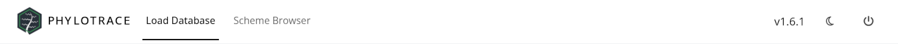

# How PhyloTrace Works {#sec-app-basics}

Before the individual panels, it helps to know a few things about the
application as a whole: where it runs, what it does and does not send over the
network, how its screens appear and disappear as you work, and why the tables and
plots you are looking at keep themselves up to date. Everything in this chapter
is about behaviour you will notice while using the app.

## A web app that runs on your own machine {#sec-app-local}

PhyloTrace opens in a browser tab, but it is **not a website**. Launching it
starts a small server on your own computer and points the browser at it. The
browser draws the buttons, tables and plots; the program behind the tab does the
work — typing genomes, querying your database, building trees — and sends the
results back to the tab.

::: {.callout-important title="Nothing leaves your machine unless you send it"}
The server, your database and the analysis toolchain all run locally, and the
browser tab talks only to your own computer. Assemblies, isolates and metadata
never leave the machine unless *you* export or share a database file.

PhyloTrace makes four kinds of outbound request, and none of them carries your
data:

- downloading a cgMLST scheme when you create a database (@sec-schemes),
- looking up the matching classical MLST scheme while typing (@sec-typing),
- turning place names into map coordinates (@sec-map),
- loading basemap tiles while the map is open (@sec-map).

The first two request public reference data; the third sends only a place
name; the fourth sends only the map's current viewport, as you pan and zoom —
never isolate identifiers or metadata.
:::

The tab is a viewer, but it is not a *disconnected* one: closing it drops the
connection the server was using, and PhyloTrace ends the session — stopping
the server — the moment that happens, the same as pressing the power button
below. The difference is that the power button asks you to confirm first;
closing the tab does not, so an accidental close (or a stray `Ctrl+W`) can end
a run in progress without warning. If you only want to check something else,
open a second tab rather than closing this one. Installing and launching
PhyloTrace is described in the project's `README`.

## The panels, and when they appear {#sec-app-panels}

PhyloTrace does not show all of its screens at once. When it starts, the
navigation bar carries only two tabs (@fig-ui-navbar-start):

| Tab | What it is for |
|---|---|
| **Load Database** | Open an existing database, or pick up the one you used last (@sec-data-open) |
| **Scheme Browser** | Choose a species, review its cgMLST scheme, and download it into a **new** database (@sec-schemes) |

{#fig-ui-navbar-start}

At the far right of the bar, whatever else is on screen, sit three items that
never move:

- the **version number** of the running build — quote it in a bug report;
- a **moon / sun button** that switches the whole interface between light and
  dark mode;
- a **power button** that closes PhyloTrace, with a confirmation prompt first —
  closing the tab itself ends the session the same way, but without asking
  (@sec-app-local).

The moment a database is loaded, four more tabs appear — in this order — and the
two starting tabs step aside:

| Tab | What it is for |
|---|---|
| **Database Browser** | Browse and edit isolates, define custom variables, inspect the scheme, import and export (@sec-browser, @sec-interop) |
| **Analysis Dashboard** | Organise and reopen the plots you have saved (@sec-dashboard) |
| **Visualization** | Build plots — MSTs, trees, epi curves, maps, AMR heatmaps (@sec-visualization) |
| **Add Isolates** | Type new assemblies into the open database (@sec-typing) |

Two further items join them: a **return arrow** that closes the database, and,
pushed to the right, the **filename of the open database** — hover it to see the
full path. That label is the quickest way to confirm which file you are working
in when several are on the machine (@fig-ui-navbar-workspace).

{#fig-ui-navbar-workspace}

This staging is deliberate: every one of those four tabs works *on* a database,
so none of them is offered until there is one open. Closing the database with
the return arrow reverses it exactly: the four workspace tabs step aside again
and Load Database and Scheme Browser return.

## Everything keeps itself up to date {#sec-app-live}

PhyloTrace behaves like a spreadsheet rather than a document: when something
changes, everything that depends on it recalculates. Type a batch of isolates and
the Database Browser, the Visualization sidebars and the Analysis Dashboard all
see the new isolates without being told to. Import a peer's database and the same
thing happens. You never have to press a refresh button to make one screen agree
with another.

::: {.callout-important title="The exception: unsaved edits are never overwritten"}
Two screens hold an editable grid where *you* are the one changing data: Browse
Entries (metadata values, @sec-browser-browse) and Custom Variables (the values
you assign to your own fields, @sec-browser-custom). Both are exceptions to
automatic refresh — if new data arrives while you have unsaved edits in the grid,
PhyloTrace marks the view as out of date rather than discarding your work.
Reloading the database is the explicit action that replaces it, and you will be
warned first.
:::

Two further actions are available once a database is open:

- **Reload Database** re-reads the file from disk. It is not a permanent button:
  it arrives inside a **notification in the bottom-right corner** whenever
  something has changed the file — a typing run finishing, an import completing —
  and the notification stays until you dismiss it. If you have unsaved edits in
  an editing grid at that moment, the notification says so in an orange warning
  before offering the button.
- The **return arrow** in the navigation bar ("Return to the start screen")
  closes the database and puts you back at **Load Database**. Nothing is lost —
  everything you have done is already in the file (@sec-data).

## How the screens are laid out {#sec-app-layout}

Almost every panel in PhyloTrace follows the same two-part shape, and knowing
which side you are on saves a lot of hunting:

- **A sidebar of controls**, either on the left (Database Browser, Add Isolates,
  Analysis Dashboard) or on the right (Import, Export, and every plot). Controls
  are gathered into labelled groups, and longer sidebars use **accordion
  sections** you click to open and close, or **tabs** across the top.
- **A main area** holding the table, plot or map the controls act on.

Two conventions recur throughout:

- A small **ⓘ icon** beside a label opens a fuller explanation — usually as a
  hover tooltip, and for the typing steps as a dialogue with a paragraph or two.
  Where the manual says a control "explains itself in the app", that is the icon
  it means.
- A **Reset settings** button sits at the bottom of every plot's control panel,
  and returns that plot's appearance to its defaults without touching the
  isolate selection or the computed data.

## Working on several things at once {#sec-app-parallel}

Two parts of the app are workspaces rather than single screens:

- **Visualization** holds as many plot tabs as you like, including several of the
  same kind. Each tab keeps its own controls, its own isolate selection and its
  own export settings, so you can compare an MST coloured by ward against the
  same MST coloured by source without rebuilding either (@sec-visualization).
- **The Analysis Dashboard** groups saved plots into named Analyses, so a
  finished investigation stays together and can be reopened exactly as you left
  it (@sec-dashboard).

## While typing runs {#sec-app-typing-parallel}

Typing assemblies is the one genuinely long-running job in PhyloTrace, and it
runs alongside the rest of the app rather than blocking it. You can keep browsing
and plotting while it works; screens that read the database will simply wait for
the moment when new isolates are being written, then show them. Progress and
per-isolate outcomes are reported live in the Add Isolates panel (@sec-typing).

While a run is in progress the controls that would interfere with it are
disabled — with one deliberate exception. **Terminate** stays clickable
throughout, so a run can always be stopped (@sec-typing-ui).

## Chapter summary

- PhyloTrace is a local application that happens to use a browser tab; your data
  stays on your machine.
- The only outbound requests are scheme downloads, classical-MLST scheme lookup
  and map geocoding — none of them sends your isolates.
- The four workspace tabs appear only once a database is loaded, and disappear
  again when you return to the start screen; the navigation bar also carries the
  version, the light/dark toggle, the power button and the open file's name.
- Nearly every panel is a control sidebar plus a main area; ⓘ icons explain
  individual controls and **Reset settings** restores a plot's defaults.
- Screens refresh themselves when the data changes; the only exception is the
  edit grid, which protects unsaved work.
- Visualization and the Analysis Dashboard are workspaces: many plots, many
  saved Analyses, all independent.

@sec-data describes the file all of this operates on.
