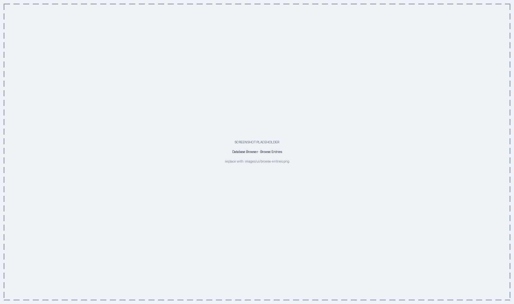
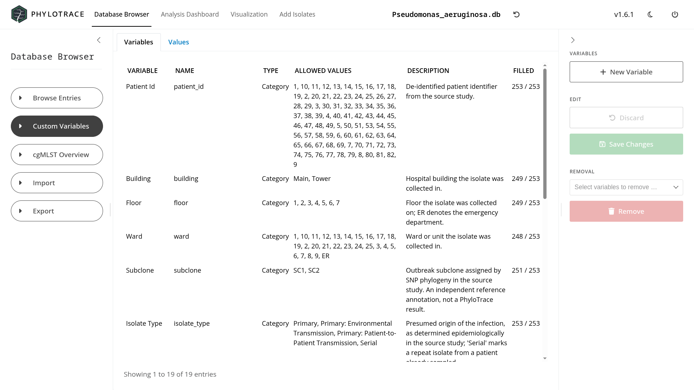
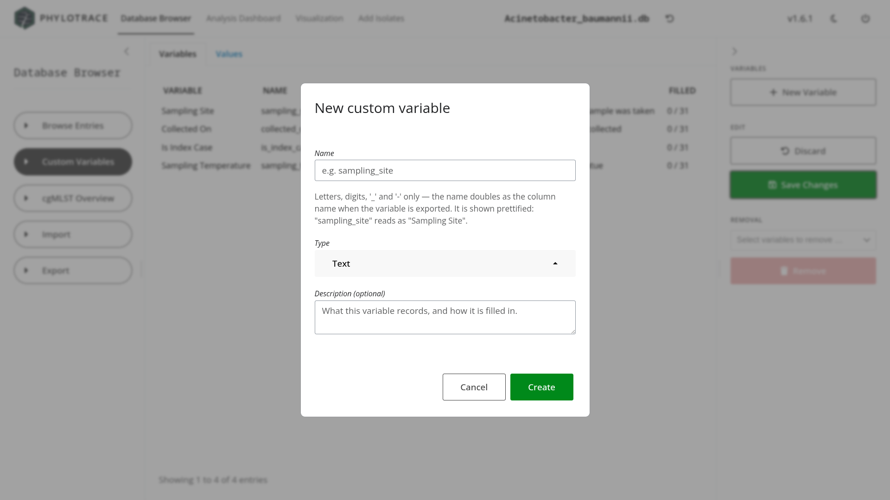

# Database Browser & Custom Variables {#sec-browser}

The Database Browser is where you read and curate the isolate table: browsing and
editing metadata, deleting isolates, and — the part that lets PhyloTrace answer
questions its standard fields cannot — defining variables of your own. This
chapter covers the **Browse Entries** and **Custom Variables** panels; the other
three panels of the same menu are covered in @sec-schemes (cgMLST Overview) and
@sec-interop (Import and Export).

The Database Browser is organised as a sidebar menu with five panels:

| Panel | What it does | Chapter |
|---|---|---|
| **Browse Entries** | View, edit and delete isolates | this chapter |
| **Custom Variables** | Define and fill in your own fields | this chapter |
| **cgMLST Overview** | Inspect the scheme and its loci | @sec-schemes |
| **Import** | Merge a colleague's database, or stage their profiles | @sec-interop |
| **Export** | Write out a chosen subset as a new database | @sec-interop |

The five panels are buttons in the left sidebar; the one you are on stays
highlighted.

## Browse Entries {#sec-browser-browse}

Browse Entries shows one row per isolate in an editable grid, with a control
sidebar on the **right** holding three groups (@fig-ui-browse-entries).

{#fig-ui-browse-entries}

### Choosing which columns to show {#sec-browser-columns}

A database of any size has far more columns than fit on a screen, so
**Column Selection** governs what is drawn. Its dropdown groups the available
fields into four categories, each with a checkbox on the group header that ticks
or clears the whole category at once:

| Category | Contents | Shown by default |
|---|---|---|
| **Sample metadata** | The standard GenEpiO field set | yes |
| **Classical MLST** | The sequence type and its per-locus alleles | no |
| **AMR screening** | One entry per drug class / virulence-stress group, each covering all the gene columns beneath it | no |
| **Custom variables** | The fields you defined yourself | yes |

MLST and AMR start hidden because they are wide and derived; tick the category
when you need them. There is a search box in the dropdown for finding a single
field by name.

::: {.callout-important title="Derived columns are read-only here — with one exception"}
The MLST and AMR columns appear merged into the grid but cannot be edited in it,
because they are results of a typing run (@sec-typing) rather than something you
fill in. Custom variables are different: a **Date** or **Number** variable can be
edited directly in this grid, exactly like a standard metadata field, with the
edit routed to the same validated write path the Custom Variables panel uses. A
**Category**, **Yes/No** or **Text** variable stays read-only here and can only
be changed on the **Custom Variables** panel (@sec-browser-custom), because those
types need their own editor — a level picker, a toggle — that this grid does not
offer.
:::

### Saving your edits {#sec-browser-edit}

The **Edit** group holds two buttons, both disabled until the grid actually has
an unsaved change:

- **Save Changes** writes them as a single transaction — either all of the
  changes land, or none do.
- **Discard** throws the pending edits away and re-reads the database.

::: {.callout-important title="Unsaved edits are never overwritten"}
If something changes the database while you have unsaved edits — a typing run
finishing, an import completing — PhyloTrace marks the view as out of date rather
than reloading over your work (@sec-app-live). The reload notification will even
warn you, in orange, that unsaved edits exist. Reloading is the explicit action
that discards them.
:::

### Deleting isolates {#sec-browser-delete}

The **Remove isolates** group is a searchable multi-select over the isolate
names, plus a red **Remove** button that stays disabled until at least one is
picked. Confirmation is a dialogue, and it asks one question before doing
anything: whether to **keep or delete the allele sequences** the removed isolates
contributed.

::: {.callout-important title="Keep the alleles unless you have a reason not to"}
**Keep allele sequences** is preselected. Keeping them costs a little space but
preserves the allele nomenclature your database has built up, so a later re-type
of the same or a related isolate lands on the same allele identifiers. **Delete
allele sequences** reclaims the space by dropping the sequences no remaining
isolate references. When in doubt, keep them.

The dialogue says "This cannot be undone", and means it — unlike an import
(@sec-interop-import), a removal leaves no backup behind.
:::

## Custom Variables {#sec-browser-custom}

The standard metadata field set follows the GenEpiO vocabulary [@genepio] and
covers the universals — collection date, place, source and so on. Investigations
routinely need one more field it does not have: a ward, a sampling site, an
outbreak identifier, a CT value. The **Custom Variables** panel is where you
define those and fill them in.

::: {.callout-tip title="Concept — why custom variables matter for outbreak work"}
PhyloTrace's visualizations derive their explanatory value from *mapping metadata
onto relatedness*: colouring an MST by ward, an epi curve by source, a map by
outbreak. The standard fields cover what every investigation has, but every
investigation also has variables of its own. A custom variable enters the same
visualization system as any standard field — define "Ward" once, fill it in, and
it becomes available to colour, shape, stratify and filter by everywhere
(@sec-visualization).
:::

### The two tabs {#sec-browser-custom-tabs}

The panel splits the work in two, because defining a variable and filling it in
are different jobs:

- **Variables** — one row per definition: its name, type, description, and how
  many isolates have a value. This is where variables are created, edited and
  deleted.
- **Values** — a grid of isolates × your variables, which is where the values
  themselves are entered (@fig-ui-custom-variables).

{#fig-ui-custom-variables}

The right sidebar mirrors Browse Entries: **New Variable** at the top,
**Discard** / **Save Changes** in the middle, and a **Removal** picker with a red
**Remove** button at the bottom.

Custom Variables is where every type of custom value can be entered — **Date**
and **Number** variables can also be edited from Browse Entries directly
(@sec-browser-columns), but **Category**, **Yes/No** and **Text** variables are
only ever editable here. Filling in values works the same way as Browse
Entries: edits sit in the grid until you press **Save Changes**, and if the
database changes elsewhere while you have unsaved edits, PhyloTrace marks the
view as out of date rather than discarding your work (@sec-app-live).

### Creating a variable {#sec-browser-types}

**New Variable** opens a dialogue with four fields (@fig-ui-custom-modal):

| Field | Notes |
|---|---|
| **Name** | Letters, digits, `_` and `-` only. Shown prettified, so `sampling_site` reads as "Sampling Site" — and used as the column name on export |
| **Type** | One of the five below; **it cannot be changed later** |
| **Allowed values** | Appears for the *Category* type only: the permitted levels, comma-separated |
| **Description (optional)** | What the variable records and how it is filled in |

{#fig-ui-custom-modal}

A custom variable is not just a name — it has a **type**, and PhyloTrace enforces
it as values are entered:

| Type | What is accepted | How it is stored |
|---|---|---|
| **Date** | A calendar date | Normalised to ISO format |
| **Yes/No** | A boolean | `yes` / `no` |
| **Number** | A numeric value | As entered |
| **Category** | One of the levels you declared | The chosen level |
| **Text** | Free text | As entered |

The type matters beyond data hygiene: it is what the visualization layer reads to
decide how the variable may be drawn. A categorical variable with a handful of
levels can be shown as colour *or* shape; one with fifty levels cannot legibly be
shown as either, and a numeric variable gets a continuous gradient rather than a
palette of discrete colours (@sec-viz-mapping). Declaring the right type is
therefore what makes a variable usable in a plot.

::: {.callout-important title="The type is fixed; the name is not"}
Reopening a variable for editing shows its type as plain text with the note "The
type cannot be changed — create a new variable instead." Everything else — name,
description, and a category's allowed values — can be changed at any time, and
renaming keeps all existing values.

So the type is the one decision worth getting right up front. If you are unsure
whether a field is a **Category** or free **Text**, prefer Category with the
levels you expect: it is the type that can be coloured, stratified and filtered
by, whereas a Text field with dozens of distinct values cannot be drawn legibly
at all.
:::

Deleting a variable removes its definition and all of its values together, in one
step. Custom variables live inside the database file, so they travel with it when
it is shared or exported (@sec-data).

## Chapter summary

- The Database Browser is a five-panel menu; Browse Entries and Custom Variables
  are covered here.
- **Column Selection** decides what the grid shows; MLST and AMR columns are
  hidden until you tick their category.
- Browse Entries edits metadata values transactionally — **Save Changes** or
  **Discard** — and shows MLST and AMR columns read-only alongside them; Date and
  Number custom variables are also editable here, but Category, Yes/No and Text
  ones are not; unsaved edits are protected from automatic reloads.
- **Remove isolates** asks whether to keep the allele sequences they contributed
  — usually you should — and cannot be undone.
- Custom Variables splits into a **Variables** tab (definitions) and a
  **Values** tab (the data); the declared type governs both validation and how
  the variable can be mapped in a plot, and it cannot be changed afterwards.
- Custom variables live inside the database file and travel with it.

@sec-interop covers sharing databases between labs; @sec-visualization uses these
variables to build plots.
