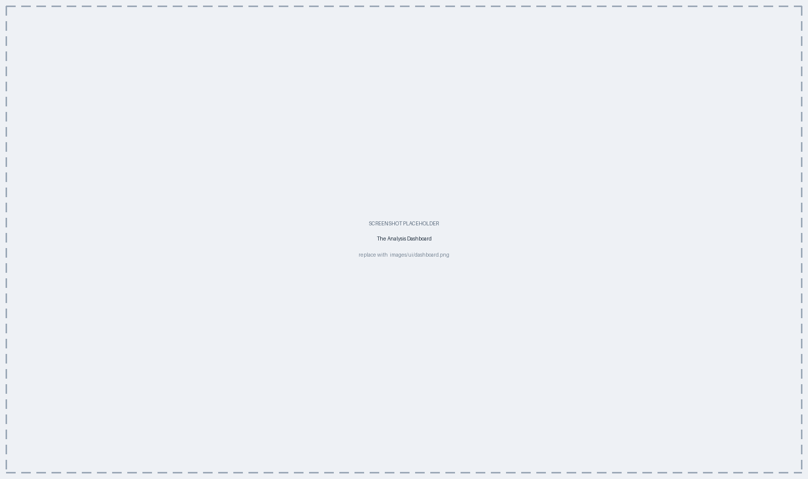
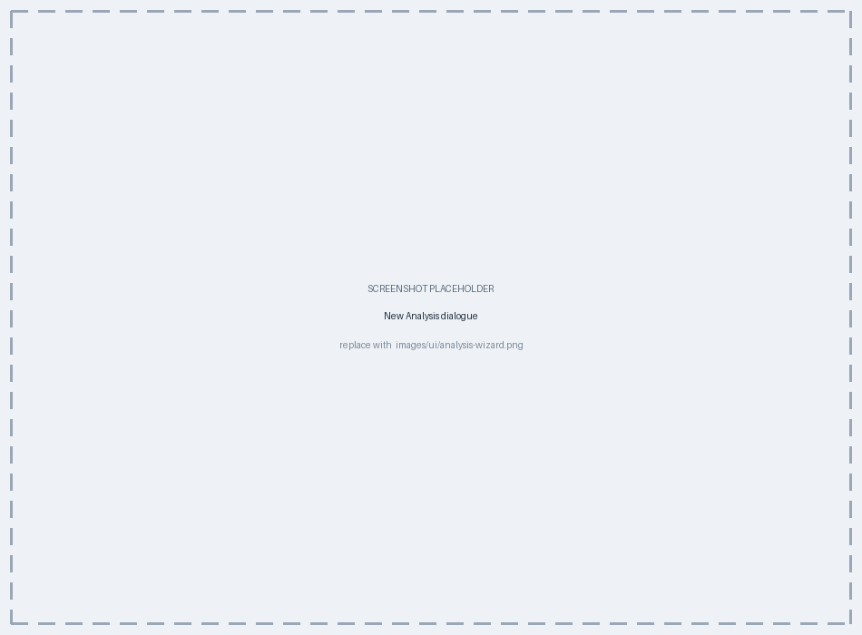

# The Analysis Dashboard {#sec-dashboard}

The Analysis Dashboard is where finished work is organised. An **Analysis** is a
named container of saved **Plots**, each holding everything needed to reproduce a
visualization, plus a thumbnail so you can find it at a glance. This chapter
covers how to use it and what saving actually preserves.

::: {.callout-tip title="Concept — an Analysis is a saved investigation"}
A completed visualization — an MST coloured by ward and restricted to a subset of
isolates, say — can be saved as a Plot inside an Analysis under a descriptive
name such as "Ward-B outbreak, June". Reopening it later restores the exact
controls and selection that produced it.

Because Analyses are stored *inside the database file* (@sec-data), a saved
investigation travels with the data whenever the database is shared. A colleague
who receives your database receives your analyses with it.
:::

## Analyses and plots {#sec-dash-structure}

The dashboard is a stack of cards, one per Analysis, with a sidebar on the left
carrying **Add Analysis** and a list for jumping between them (@fig-ui-dashboard).
Each card's header shows the Analysis name, when it was created and last
modified, and — where the Analysis fixes an isolate set — a padlock badge
reading "*n* fixed isolates". Inside it, the saved plots sit as a row of tiles
with live thumbnails, ending in an **Add Plot** placeholder.

{#fig-ui-dashboard}

### Creating an Analysis {#sec-dash-create}

**Add Analysis** opens a two-step dialogue (@fig-ui-dash-wizard):

1. **Analysis name** and an optional **Description**, then **Next**.
2. The isolate table, ticked as you like, with **Select all** / **Select none**
   and the same date filter as the plot selection dialogue (@sec-viz-selection).
   **Create Analysis** finishes.

{#fig-ui-dash-wizard}

The pencil icon in a card header reopens the same dialogue to change the name,
description or isolate set. If the Analysis already holds saved plots, step two
warns you — "*n* saved plots built from this set" — because changing the set
re-bases them (@sec-dash-selection).

### Working with saved plots {#sec-dash-plots}

Each plot tile carries three buttons in its corner, and one large invisible one:

| Action | How |
|---|---|
| **Open** | Click the thumbnail. The plot is restored into a Visualization tab |
| **Duplicate** | The copy icon. Adds a copy at the end of the row, no confirmation |
| **Rename** | The pencil icon. Turns the title into a text field; the icon becomes a tick |
| **Delete** | The bin icon. Asks first |

**Add Plot**, at the end of the row, takes you to the Visualization tab with that
Analysis already preselected as the save target (@sec-viz-save) — the quickest
route from "this investigation needs one more figure" to having it.

At the card level, **Delete Analysis** removes the Analysis and every plot inside
it; its confirmation dialogue says so explicitly. @fig-dash summarises how the
pieces relate.

```{mermaid}
%%| label: fig-dash
%%| fig-cap: "The dashboard organises saved plots into named Analyses, all stored inside the database file; opening a plot restores it into a Visualization tab."
flowchart TD
  D["Analysis Dashboard"] --> A1["Analysis<br/><i>e.g. 'Ward-B outbreak, June'</i>"]
  A1 --> P1["Saved plot<br/>(thumbnail)"]
  A1 --> P2["Saved plot<br/>(thumbnail)"]
  D -. stored in .-> DB[("Your database file")]
  P1 -. "open" .-> V["Visualization tab<br/>restored as saved"]
```

## What a saved plot preserves {#sec-dash-saved}

Saving a plot stores its type, the complete set of settings behind it, and a
thumbnail image.

::: {.callout-important title="What is saved is the recipe, not the picture"}
The stored settings are what make a plot **restorable**: reopening it feeds them
back into a fresh Visualization tab and rebuilds the figure from your current
data. The thumbnail is only for finding it in the dashboard.

The practical consequence: if isolates have been added, edited or deleted since
you saved, reopening the plot draws the *current* data with your saved settings —
so a saved MST may gain nodes. That is usually what you want. If you need a frozen
picture of a figure exactly as it looked on a given day, export it
(@sec-viz-export) and keep the file.
:::

## Selections that outgrow their Analysis {#sec-dash-selection}

An Analysis records both the isolate selection you made and the pool of isolates
that existed when you made it. That is how PhyloTrace can tell when the database
has grown or changed underneath a saved Analysis, and reconcile the selection
rather than silently plotting the wrong set.

When a plot no longer matches the isolate set its Analysis now uses, its tile is
flagged in place — an orange warning reading **"Isolates changed (+3 -1)"**,
counting what has been added and removed. The plot is not broken and nothing has
been lost; reopening it rebuilds the figure against the current selection, and
saving it again clears the flag.

The dashboard also keeps itself current: saving a plot from the Visualization
tab, or importing new isolates, updates it without a manual reload
(@sec-app-live).

## Chapter summary

- An Analysis is a named container of saved plots, stored inside the database
  file and shared with it; **Add Analysis** creates one in two steps, name then
  isolate set.
- **Add Plot** jumps to Visualization with the Analysis preselected; clicking a
  thumbnail restores that plot into a tab. Tiles can also be duplicated, renamed
  and deleted.
- Saving preserves the settings, not the rendered image — a reopened plot uses
  your current data.
- Export a figure if you need a frozen record of exactly how it looked.
- An Analysis remembers the isolate pool it was made against, and flags any plot
  whose set has drifted, so a grown database does not silently change what a
  saved plot shows.

That completes the tour of the application. The appendices list the external
tools and data sources PhyloTrace relies on (@sec-appendix-tools) and define the
terms used throughout (@sec-glossary).
