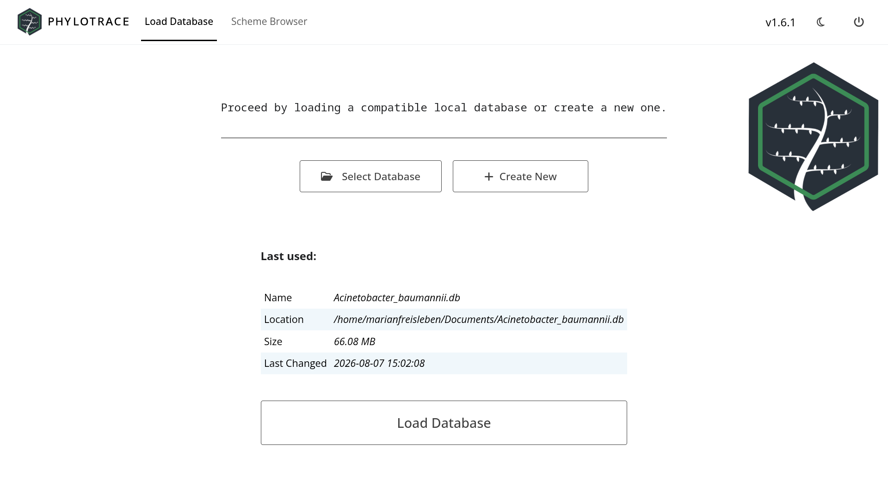

# Your Database {#sec-data}

Everything PhyloTrace knows about a population of isolates lives in **one file**.
That single fact explains most of how the app behaves: why a database belongs to
exactly one scheme, why saved plots reappear on a colleague's machine, and why
backing up your work means copying one file. This chapter is about that file —
what it holds, what it is for, and how to look after it.

::: {.callout-tip title="Concept — your database is the document"}
There is no hidden application state on your computer that a colleague is missing
when you send them a database. The file *is* the project: the isolates, their
allele profiles, their metadata, your custom variables, the AMR results, the
record of how each isolate was typed, and even your saved analyses and plots are
all inside it. Copy the file and you have copied everything — which is what makes
comparison between labs a matter of sharing one file (@sec-interop).
:::

## What a database contains {#sec-data-contents}

| What | Where it comes from | Chapter |
|---|---|---|
| The **scheme** — which loci to type, the known alleles, the reference genome | Downloaded when the database is created | @sec-schemes |
| **Allele profiles** — each isolate's allele at every locus | Written as each assembly is typed | @sec-typing |
| **Classical MLST** — the 7-gene sequence type per isolate | Resolved during the same typing run | @sec-typing |
| **AMR, virulence and stress findings** | The screen that runs with typing | @sec-amr |
| **Metadata** — collection date, place, source and the rest of the standard field set | Entered or imported by you | @sec-browser |
| **Custom variables** — the fields you define yourself | Created in the Custom Variables panel | @sec-browser |
| **Typing provenance** — how each isolate was typed: which assembly, which scheme, which tool versions | Recorded automatically during typing | @sec-typing |
| **Saved analyses and plots** | Saved from the Visualization tab | @sec-dashboard |

The first four are produced for you; the middle two are yours to fill in; the
last two are records the app keeps so your results stay traceable and
reproducible.

## One database, one scheme {#sec-data-scheme}

A database is created *around* a scheme, and it keeps that scheme for life. Every
allele profile in the file is expressed in terms of that scheme's loci, so mixing
in isolates typed against a different one would be meaningless.

::: {.callout-important title="What this means in practice"}
- To work on a second species, create a **second database** (@sec-schemes).
- You can only merge a colleague's database into yours when both were built from
  the **same scheme** — PhyloTrace checks this before offering the merge, and
  compares the reference genome as well as the locus names, because two schemes
  can share locus names and still be incompatible (@sec-interop).
- Because the scheme travels inside the file, a database you receive can be
  opened and analysed without downloading anything.
:::

## Opening a database {#sec-data-open}

The **Load Database** tab is a single screen with two buttons under a line of
instructions:

- **Select Database** opens a file chooser rooted at your home folder. Pick a
  `.db` file and PhyloTrace shows its path, then a small table of the file's own
  details — size and modification date — so you can confirm you have the right
  one before committing.
- **Create New** takes you to the Scheme Browser instead, which is where a
  database is brought into existence (@sec-schemes).

**Load Database**, the button below the table, stays greyed out until a file is
actually selected. Clicking it opens the file.

{#fig-ui-landing}

Loading is the moment the app comes to life: the four workspace tabs appear
(@sec-app-panels) and every view starts reading from the file. Before that
happens, PhyloTrace runs a short set of housekeeping checks on it so that every
panel is guaranteed to be looking at the same, current picture:

- the scheme's species name is brought to its correct spelling,
- any allele that has not yet had its content fingerprint computed gets one
  (this is what makes sharing between labs reliable, @sec-concepts-hashing),
- the metadata table is created if the database has never had one, and given a
  row for every isolate that has been typed.

All three are harmless on a database that is already up to date, so opening an
established file costs nothing. You will see a short loading screen while they
run.

The landing screen also remembers the database you used last, so returning to
yesterday's work is a single click.

## Naming things {#sec-data-naming}

Anything you type that becomes a **name** — a database, an isolate, a custom
variable — is restricted to letters, digits, hyphens and underscores. Spaces and
punctuation are not accepted in those fields.

This is enforced as you type: in a restricted field, a disallowed character
simply does not appear, rather than being rejected later with an error. If a key
seems not to work in a name field, that is why.

The restriction is not arbitrary: those names are used as filenames when you
export, and as identifiers inside the database, so keeping them simple is what
lets a database be copied between machines and operating systems without
anything breaking.

Free text *is* allowed where a value is only ever displayed — plot names,
analysis names and descriptions, legend and annotation labels, custom-variable
levels, and metadata values such as a collection site. Those fields take spaces
and punctuation normally.

## Looking after your data {#sec-data-care}

- **Back up by copying the file.** There is nothing else to save.
- **Share by sending the file** — or, when you want to share only part of it, use
  the Export panel to build a new database containing exactly the isolates and
  the metadata columns you choose. Columns you leave out are never written to the
  exported file (@sec-interop).
- **Importing is reversible.** Merging a colleague's database leaves your
  original file untouched as a timestamped backup alongside the merged one, and
  nothing is changed until the merge has completed successfully (@sec-interop).
- **Deleting isolates is deliberate and immediate.** **Database Browser >
  Browse Entries > Remove isolates** removes them from the database, and asks
  whether the allele sequences they contributed should be kept for future
  comparisons (@sec-browser-delete).

## Chapter summary

- One file holds the scheme, the profiles, the results, your metadata and custom
  variables, the typing record, and your saved analyses.
- A database belongs to one scheme for life; a second species needs a second
  database, and merging requires a matching scheme.
- Opening a database runs a few automatic checks so every panel sees the same
  current data.
- Names of databases, isolates and variables are restricted to simple characters;
  free text is allowed wherever a value is only displayed.
- Backing up is copying the file; exporting builds a new file with only what you
  select; importing keeps a backup of the original.

Part III follows a dataset through the app, beginning with the scheme
(@sec-schemes).
