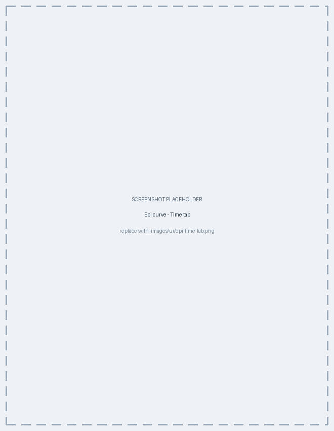
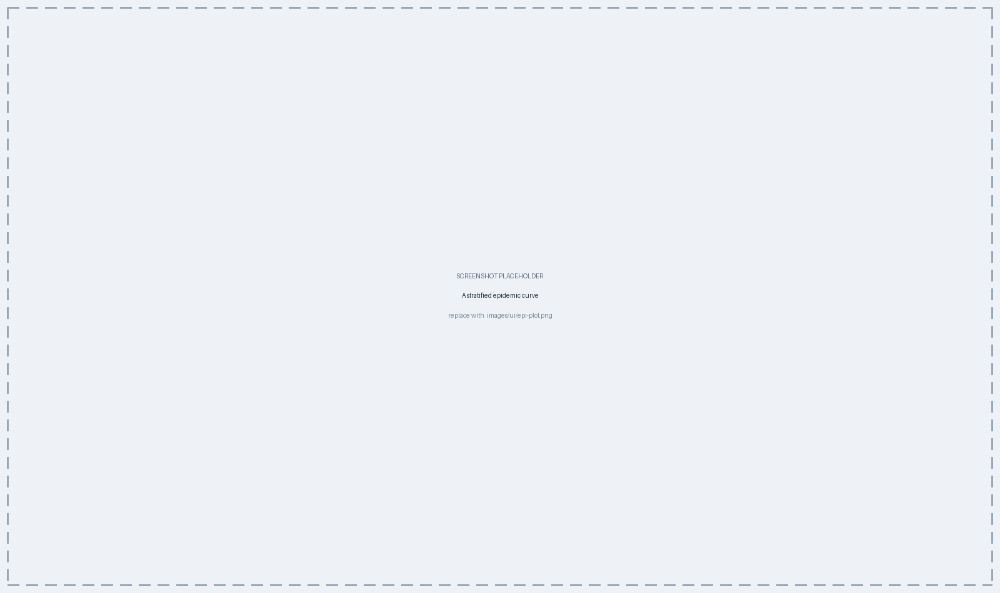

# Epidemiological Curves {#sec-epicurve}

The epidemic curve is the oldest tool in outbreak investigation and the one plot
type here that uses no genetics at all: it counts cases over time. This chapter
covers how PhyloTrace bins dates, what the derived series show, how to stratify a
curve, and the playback feature. The concept is in @sec-concepts-epi.

## Dates, not distances {#sec-epi-nodist}

The epi curve reads each isolate's collection date from its metadata and counts
cases per interval. No pairwise comparison is involved, so — unlike the MST and
the tree — every control takes effect **live**, with no Generate step
(@sec-viz-generate). It uses your own typed isolates; staged partner profiles
(@sec-interop-staging) carry no metadata dates and do not appear.

::: {.callout-important title="Undated isolates are dropped, and the count is reported"}
An isolate with a missing or unreadable collection date cannot be placed on a
time axis, so it is left out of the curve — and PhyloTrace tells you how many
were dropped. Treat a large dropped count as a data-quality signal: a curve built
from half your collection is not the epidemic curve of your outbreak.
:::

## The control panel {#sec-epi-controls}

The epi curve's right-hand sidebar has four tabs.

| Tab | What it holds |
|---|---|
| **Layout** | **Plot Mode** and its derived series, **Stratification**, **Axes & Sizing** |
| **Time** | The date-range slider, the **Interval** buttons, and playback |
| **Colors** | The palette when stratified, or a single series colour; text, background, and one swatch per derived line |
| **Annotations** | Milestones and shaded periods |

## Binning and the shape of the curve {#sec-epi-build}

Cases are grouped into intervals, chosen under **Time > Interval**: **Day**,
**Week**, **Month** or **Year**. PhyloTrace preselects the finest interval that
keeps the number of bars readable — under about 150 — and you can override it at
any time. Weeks follow the ISO-8601 convention, starting on Monday.

{#fig-ui-epi-time}

::: {.callout-important title="The conventions that keep the curve honest"}
Two drawing rules follow standard epi-curve practice and matter for
interpretation:

- **The vertical axis counts whole cases**, so it carries only integer ticks. A
  curve never suggests half a case.
- **Every bar is exactly one interval wide**, and bars touch. That means a gap in
  the curve is a **genuine gap in the data** — an interval with no cases — and
  never a drawing artefact.

Changing the interval changes the shape of the curve, sometimes considerably. A
daily curve of a slow outbreak looks like scattered noise; a monthly curve of a
point-source outbreak hides the sharp peak that identifies it. Try more than one
interval before concluding anything about shape.
:::

## Plot mode, cumulative view and moving average {#sec-epi-derived}

**Layout > Plot Mode** chooses between three ways of drawing the same counts:

| Mode | What it draws |
|---|---|
| **Stacked** | The conventional solid bars, stacked by stratum. The default |
| **Square blocks** | The same bars drawn as one square per case — the classic hand-drawn epi curve, and the most readable form for small outbreaks |
| **Cumulative** | The running total as a curve, rather than per-interval bars |

In the two bar modes, two derived series can be laid over the bars:

- **Show cumulative curve** — the running total, on a secondary axis. Offered
  only in the bar modes, since Cumulative mode *is* that total.
- **Show moving average** — a smoothed trend line, labelled with its window (for
  example "7-day moving average"). Switching it on reveals two more controls: a
  **Moving average window** slider, counted in whatever interval is currently
  selected, and a **Window alignment** of **Centered** or **Trailing**. Intervals
  with no cases are counted as zero rather than skipped, so the average is not
  inflated by gaps.

In Cumulative mode a **Label lines** switch names each line where it ends,
instead of leaving the legend to say which colour is which.

::: {.callout-important title="Trailing or centred is an analytical choice"}
A **centred** window is the more honest summary of a completed outbreak: each
point sits in the middle of the data that produced it. A **trailing** window is
what real-time surveillance uses, because it only ever looks backwards — but it
lags the true peak by roughly half its width. If you are annotating a curve with
"the peak was here", make sure the alignment is not the reason it moved.
:::

## Stratifying and colouring {#sec-epi-strata}

**Layout > Stratification** splits and colours the cases by any metadata field or
custom variable — by source, by ward, by isolate origin, by sequence type.
Combining two variables produces composite strata.

The **Colors** tab follows what you did there. With a stratification in place it
offers a **palette**; with none, a single **Series** colour instead. Text and
background swatches are always present, and one more appears for each derived
line that is currently switched on — **Cumulative line** and **Moving average
line** — so nothing is left to guess.

::: {.callout-important title="Palettes are sized to the number of groups"}
PhyloTrace offers only palettes that can actually represent the number of groups
you have, and interpolates where a request exceeds a palette's native size. A
12-group stratification therefore never silently drops groups into an
undifferentiated grey — the failure mode that makes a stratified curve look fine
while omitting half its categories (@sec-viz-mapping).
:::

## Annotations {#sec-epi-anno}

The **Annotations** tab marks events on the timeline. Pick a **Type** —
**Milestone (line)** for a single date, **Time period (shaded)** for a span,
which reveals a second date field — then a **Start date** (and end date), a free-text
**Label** and a **Color**, and press **Add to timeline**.

Annotations accumulate: each is listed below the button so it can be removed
individually, and **Clear all** removes them together. Their labels are laid out
so they do not collide with one another. An index case, an intervention date, a
ward closure — this is where the epidemiology goes onto the figure.

## Playback {#sec-epi-playback}

The **Time** tab's date-range slider windows the curve to a span you drag out,
and **Play** animates it: the window sweeps forward from the start handle, one
interval at a time. The angle buttons on either side step the start and end
handles by exactly one interval, for stepping through a story rather than
watching it run.

**Zoom axis to selection**, off by default, decides what the axis does while this
happens. Left off, the axis stays fixed to the dataset's whole span, so the
window moves inside a stable frame and the growth is visible; switched on, the
axis follows the window instead.

Playback is useful in a briefing: it shows *when* the outbreak was recognisable,
and it makes the difference between a point-source peak and successive
person-to-person waves much easier to convey than a static figure does.

```{mermaid}
%%| label: fig-epi
%%| fig-cap: "The epi curve counts cases per interval from the collection dates; derived series and stratification layer on top, and all controls take effect live."
flowchart LR
  MD["Collection dates<br/>(+ optional stratifying variable)"] --> B["Count cases per interval"]
  B --> C["Cumulative series"]
  B --> MA["Moving average"]
  B --> R["The curve"]
  C --> R
  MA --> R
```

{#fig-ui-epi}

## Export {#sec-epi-export}

The epi curve exports as a **vector PDF or SVG**, or as a raster (PNG, JPEG,
TIFF) at the DPI you request (@sec-viz-export) — publication quality directly out
of the app.

## Chapter summary

- The curve counts cases per interval from collection dates; controls take effect
  live, with no Generate.
- Undated isolates are dropped and counted — check that number.
- Integer axes and one-interval-wide touching bars mean a gap is a real gap;
  **Time > Interval** strongly affects the apparent shape.
- **Layout > Plot Mode** offers Stacked, Square blocks and Cumulative; the two
  bar modes can carry a cumulative overlay and a moving average whose window and
  alignment you set.
- **Layout > Stratification** splits the cases; the **Colors** tab follows that
  choice, and **Annotations** marks milestones and periods on the timeline.
- **Play** on the Time tab reveals the curve interval by interval; export is
  vector or high-DPI raster.

Geographic mapping — the other genetics-free plot type — is @sec-map.
