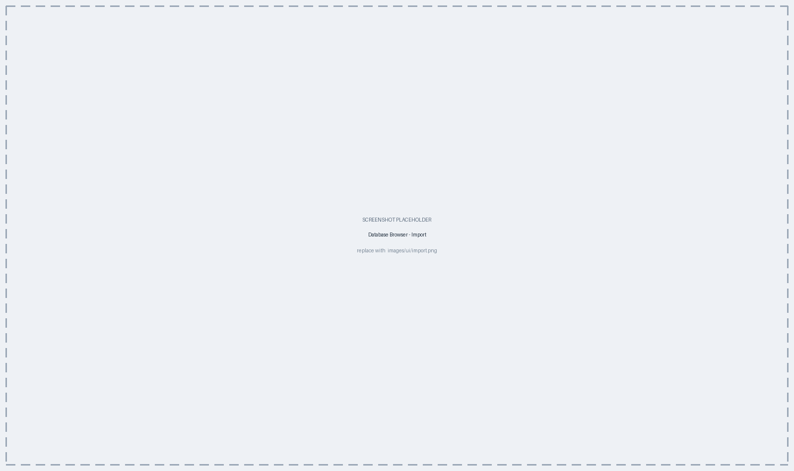
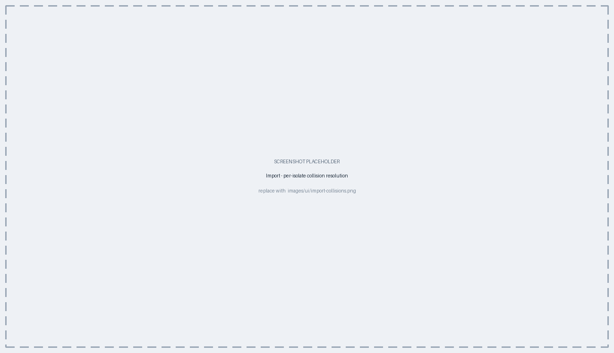

# Import, Export & Working with Other Labs {#sec-interop}

A PhyloTrace database is a document: copying the file copies everything, and two
labs can compare or pool their isolates by exchanging files. This chapter covers
what you can share, what happens when you merge a colleague's database into
yours, how to export only part of your own, and what to do when a partner sends
allele profiles rather than a database.

::: {.callout-tip title="Concept — why sharing is hard, and how PhyloTrace solves it"}
Two databases can only be combined if they agree on what "the same allele" means.
They cannot rely on allele *numbers*: each database numbered its alleles in the
order it happened to encounter them, so allele 5 of a given locus in one file is
almost never allele 5 in another.

PhyloTrace sidesteps this entirely by identifying every allele by a fingerprint
of its DNA sequence (@sec-concepts-hashing). A merge never trusts an incoming
number — it matches alleles by content and assigns fresh local numbers only to
sequences your database has genuinely never seen. This is why a merge is safe
even between databases that have never met.
:::

## What can be shared {#sec-interop-what}

| You receive | What you can do with it |
|---|---|
| A **PhyloTrace database** built from the same scheme | Merge it into yours — the isolates become full members of your database |
| A **PhyloTrace database** built from a different scheme | Open it on its own; it cannot be merged |
| A **profile table** (allele identifiers, no sequences) | Stage it for distance comparison only (@sec-interop-staging) |

## Merging a colleague's database {#sec-interop-import}

**Database Browser > Import** merges another PhyloTrace database into the one you
have open. Its right-hand sidebar is a checklist you work down from the top.

The first control, **Source**, decides what everything below it means:

| Source | What it accepts | What happens |
|---|---|---|
| **PhyloTrace database (.db)** | A peer's whole database | A full merge — the isolates become yours (this section) |
| **Typing results (table)** | A profile table, optionally with sequences and metadata | Staging for distance comparison only (@sec-interop-staging) |

With the database source chosen, **Select database …** opens a file chooser, and
the main area fills with a pass / warn / fail grid of compatibility checks
(@fig-ui-import). The remaining sidebar groups — **Metadata fields**, **Custom
variables**, **Analysis results** — decide what comes across, and **Merge into
database** at the bottom performs it. It stays disabled until the checks pass.

{#fig-ui-import}

Metadata fields and custom variables both default to *everything the peer has*,
so the usual case needs no decisions. The **Analysis results** group offers
**Classical MLST results** and **AMR results** as checkboxes, and appears only
for the tables the incoming database actually carries.

### The compatibility check {#sec-interop-compat}

Before a merge is offered at all, PhyloTrace checks that both databases were
built from the **same scheme**: same organism, same scheme identity, same set of
loci — and, the strongest test, the **same reference genome**. Each check is one
badge in the grid, so a failure names itself rather than leaving you with a
button that will not light up.

::: {.callout-important title="Why the reference genome is checked too"}
Two schemes can use the same locus names and still be incompatible, because the
loci were defined against different reference genomes. Comparing locus names
alone would let such a pair merge and produce silently meaningless distances.
PhyloTrace therefore compares the reference alleles themselves, which is a direct
test of whether the two files really are measuring the same thing.

If the check fails, the merge is simply not offered. This is not something to
work around — the two datasets are not comparable.
:::

### Resolving collisions {#sec-interop-collisions}

Once the databases are known to be compatible, every incoming isolate is
classified:

- **Novel** — not present in your database; imported straightforwardly.
- **Duplicate** — the same isolate you already have.
- **Clash** — a different isolate that happens to carry a name you already use.

Novel and duplicate isolates need no attention: they default to *import* and
*skip* respectively, and are reported only as counts. **Only the clashes get a
row of their own** (@fig-ui-import-clash), each with a dropdown offering
**import**, **skip** or **rename**, and a text field pre-filled with a free
name — the original with `_ext` appended — for the rename case.

{#fig-ui-import-clash}

A preview reports exactly what the merge would do, in counts, **before anything
is written**.

Custom variables from the incoming database are adopted only where you selected
them in the sidebar *and* where the declared types are compatible with your own.
A variable the peer defines with a different type than yours cannot be merged;
the panel says so by name rather than dropping it silently.

::: {.callout-important title="A merge cannot corrupt your database"}
Nothing is written to your live database during a merge. The work happens on a
copy, in a single transaction, and the copy takes the place of the original only
after it has completed cleanly. Your original file is kept alongside it as a
timestamped backup, so a merge is always reversible.

The sidebar's last group, **Rollback**, is where that backup is used: it lists
the timestamped copies and restores the one you pick. When a merge finishes,
PhyloTrace also offers a **Reload Database** notification so every panel picks up
the new isolates.
:::

@fig-import walks through the whole merge, end to end.

```{mermaid}
%%| label: fig-import
%%| fig-cap: "Importing a peer database. Nothing touches your live file until the merge has completed successfully, and the original is kept as a timestamped backup."
flowchart TD
  A["Colleague's database"] --> G{"Same scheme?"}
  G -- no --> X["Merge not offered"]
  G -- yes --> C["Classify each isolate:<br/>novel · duplicate · clash"]
  C --> P["Preview: what would happen<br/><i>nothing written yet</i>"]
  P --> R["You decide per isolate:<br/>import · skip · rename"]
  R --> M["Merge on a copy"]
  M --> S["Copy takes the place<br/>of your database"]
  S --> B["Original kept as<br/>a timestamped backup"]
```

## Where each isolate came from {#sec-interop-sources}

After a merge, isolates keep a record of their origin — locally typed, or
imported from a named partner. Those labels are stable: repeated imports from the
same partner keep the same label even if they rename their file, and two
different partners who happen to use the same filename are given distinguishable
labels. Because origin is an ordinary field, you can colour, stratify and filter
by it like any other (@sec-visualization) — which is exactly what you want when
you are asking whether a cluster spans two labs.

## Exporting a subset {#sec-interop-export}

**Database Browser > Export** is Import's mirror image (@fig-ui-export): the
same right-hand sidebar shape, worked down from the top. **Export type** is
again the control that decides what everything below it means:

| Export type | Output | For |
|---|---|---|
| **PhyloTrace database (.db)** | A complete, standalone database | A colleague to import, or a trimmed working copy |
| **Typing results (table)** | A profile table, with the sequences optionally alongside | A partner using other tools, or an analysis outside PhyloTrace |

{#fig-ui-export}

The groups below it are:

- **Isolates** and **Metadata** — searchable multi-selects over what to include.
  Both default to everything, so trimming is opt-in.
- **Custom variables** — the same, for your own fields.
- **Sequence data** *(table export only)* — **None**, a **single FASTA**
  (`>locus|hash`), or **one FASTA per locus** in a zip. This is what turns a bare
  profile table into something a partner can anchor against their own alleles
  (@sec-interop-staging).
- **Table format** *(table export only)* — Excel workbook, tab-separated or
  comma-separated.
- **Analysis results** — **Classical MLST results** and **AMR results** as
  checkboxes.
- **Destination** — a save dialogue, offering the extension the current settings
  will actually produce.
- **Export** — disabled until a destination is set.

The main area shows a live summary of what the current selection would write —
isolate, allele and locus counts — before anything is written.

::: {.callout-important title="Columns you withhold are never written"}
The exported file is **built fresh**, not copied and then pruned. Isolates you did
not select and metadata columns you withheld are never written to the output at
any point, not even temporarily. That matters, because the reason for choosing
columns is usually that some of them are confidential.
:::

The exported `.db` is a complete, standalone PhyloTrace database: the recipient
opens it like any other, and it can equally be used directly by the underlying
typing toolchain.

## Staging: profiles for comparison only {#sec-interop-staging}

Sometimes a partner sends a **profile table** — allele identifiers, without the
underlying sequences. PhyloTrace can use these, but only in a limited way.

To bring one in, set **Import > Source** to **Typing results (table)**. Three
file buttons appear in place of the database chooser:

| Button | Required? | What it takes |
|---|---|---|
| **Profile table …** | yes | The allele calls, as `.tsv`, `.csv` or `.xlsx` |
| **Sequences …** | optional | The matching allele FASTA |
| **Metadata …** | optional | A metadata table for these isolates |

Below them, **Set name** gives the batch a label — something like
`partner-lab-2026`. That name is what you will pick the set by later, in a plot's
**Imported typing results** dropdown (@sec-viz-staged), so make it recognisable.
The action button reads **Add typing results** rather than *Merge into database*,
which is the difference in a nutshell.

::: {.callout-important title="Staged isolates can be compared, not typed against"}
Allelic distance only asks whether two alleles are the *same*, not what they
are, so isolates known by identifier alone can legitimately take part in a
distance matrix, an MST or a tree. But they cannot become full members of your
database: without the DNA behind each call, they cannot contribute alleles, be
re-typed, or be exported as a typing database.

PhyloTrace therefore keeps them separate from your typed isolates. They appear in
distance-based plots and nowhere else — not in the AMR views, which need a screen
that was never run on them (@sec-amr-heatmap).
:::

Whether a partner's identifiers can be used at all depends on what they are.
Content fingerprints are universal and work immediately. Plain numbers are
meaningful only within the database that assigned them, so PhyloTrace checks
whether they can be anchored to alleles in your file and flags them when they
cannot. Profile tables from other tools are also accepted, with common
conventions — such as chewBBACA's markers for novel alleles — recognised on the
way in.

## Chapter summary

- Allele identity travels as a content fingerprint, so databases that have never
  met can still be merged safely; allele numbers never travel.
- **Import > Source** and **Export > Export type** are the controls that decide
  whether you are working with a whole database or a profile table.
- A merge is offered only between databases built from the same scheme, verified
  down to the reference genome, and reported as a grid of named checks.
- Only genuine **name clashes** need a per-isolate decision — import, skip or
  rename; the merge runs on a copy and leaves your original as a timestamped
  backup, restorable from the **Rollback** group.
- Export builds a new database — or a profile table, with or without sequences —
  containing only the isolates and columns you select; withheld data is never
  written.
- Profile tables from partners are staged under a **Set name** for distance
  comparison, and never become typed isolates.

Part IV turns to what all this data is for: the plots.
