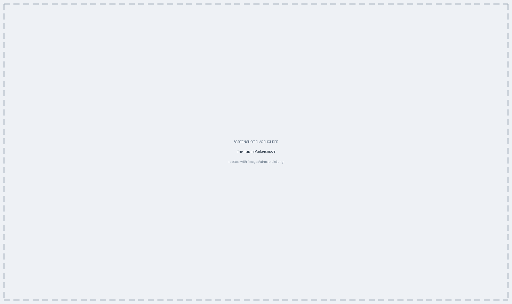

# Geographic Mapping {#sec-map}

The map places isolates in space. Where they were collected is metadata, so —
like the epi curve — the map needs no genetics; its work is turning place names
into coordinates and presenting them in four different ways.

## From place names to coordinates {#sec-map-geocode}

Isolate locations come from the metadata's spatial fields — city,
state/province and country. Those are names, not coordinates, so PhyloTrace
**geocodes** them: each distinct place is looked up once, when you press
**Generate**, using the OpenStreetMap / Nominatim service.

This is the map's one reason to need a Generate. Everything else on the panel
takes effect live. After each pass, a status line under the control tabs reports
**how many isolates were placed**, and names a few of the place names it could
not resolve — that line is the first thing to read when the map looks emptier
than expected.

::: {.callout-tip title="Concept — why geocoding happens once per distinct place"}
Two hundred isolates from the same city share one location. Looking each isolate
up separately would be two hundred identical requests to a public, rate-limited
service. PhyloTrace looks up each *distinct* place once and reuses the coordinate
for every isolate there — faster for you, and considerate of a free service.
:::

::: {.callout-important title="What is sent, and what a failed lookup means"}
Two things about the map leave your machine, and neither carries isolate data
(@sec-app-local): geocoding, which sends only a place name; and the basemap
tiles themselves, fetched continuously from the tile provider as you pan and
zoom, which send only the visible map area. Neither ever sends an isolate
identifier, a profile, or any other metadata.

A place that cannot be resolved is left off the map — and named in the status
line. The usual causes are spelling variants, an ambiguous name, or a field
filled in with something that is not a place. Consistent, resolvable place names
in the metadata are what make the map useful; **Database Browser > Browse
Entries** is where you fix them (@sec-browser-browse).
:::

## Four modes {#sec-map-modes}

**Map mode**, the picker at the very bottom of the control panel below the tabs,
is the map's most important control — it changes not only the drawing but which
control tabs are offered.

| Mode | What it shows | Use it for |
|---|---|---|
| **Markers** | Styled points, clustered per location | Seeing individual collection sites |
| **Choropleth** | Countries shaded by isolate count | Country-level surveillance overviews |
| **Heatmap** | A point-density surface | Where sampling is concentrated |
| **Charts** | A mini-chart per location | Composition at each site — the split by ward, source or ST |

{#fig-ui-map}

Each mode also switches to a base map suited to it (@fig-ui-map shows the
default for Markers) — a plain grey canvas under a choropleth, a light one under
a heatmap — which you can override under **Basemap > Base map**. Choropleth
mode draws no base tiles at all, only place labels, because a textured
background reads through a partly transparent fill; the Base map picker is
hidden there for that reason.

All four are drawn by the same underlying builder, so they stay visually
consistent with one another and with the map you export.

::: {.callout-important title="A map shows where isolates were collected, not where infection occurred"}
Collection place is a sampling artefact as much as an epidemiological fact: it
reflects which laboratory submitted the isolate, not necessarily where exposure
happened. A dense spot on the map may mean an outbreak, or may mean one
well-sequencing hospital. Read the map alongside the MST — geography plus
relatedness is informative in a way geography alone is not.
:::

## The control panel {#sec-map-controls}

The map's tabs change with the mode (@fig-ui-map-modes). Six tabs are always
present:

| Tab | What it holds |
|---|---|
| **Basemap** | Base map tiles, **Scale bar**, **Minimap inset**, **Lat/long grid**, **Zoom controls** |
| **Markers** | Clustering radius and behaviour, marker style and size |
| **Color** | **Variable Mapping** and the palette, scale type and bins |
| **Legend** | Show, position, title, opacity, number digits |
| **Labels** | **Popup fields** (shown on click) and **Hover field(s)** |
| **Time** | A date-range slider with the same step and **Play** controls as the epi curve |

Three further tabs appear only in the mode they belong to:

| Tab | Mode | What it holds |
|---|---|---|
| **Region** | Choropleth | **Count scale** (Raw or Log), **Fill opacity**, **Border color**, and switches for always showing labels or only labelling areas with isolates |
| **Density** | Heatmap | **Radius** and **Max intensity (isolates)** — the two knobs that change what the surface communicates |
| **Charts** | Charts | **Chart type** (Pie, Bar or Polar area), the mini-chart's own **Variable** picker, **Chart size** and **Opacity** |

{#fig-ui-map-modes}

**Markers > Clustering** is worth knowing about, because it changes what a dot
means. Nearby markers are merged into a numbered cluster whose **Cluster radius
(px)** you set; clicking one zooms to its contents (**Zoom to bounds on cluster
click**), and at maximum zoom overlapping markers fan out rather than hiding each
other (**Spiderfy at max zoom**). So a single dot on a zoomed-out map may stand
for many isolates, exactly as an MST node may (@sec-mst-read).

Two other conveniences: **Reset view** returns the map to the extent that fits
all placed isolates, and the **Time** tab windows the map to a date range and can
animate it forward — the geographic counterpart of the epi curve's playback
(@sec-epi-playback).

## Colouring and variables {#sec-map-vars}

**Color > Variable Mapping** encodes any metadata field or custom variable onto
marker colour: switch on **Color by variable** and pick one under **Variable**
(@sec-viz-mapping). In Charts mode marker colour is replaced by the mini-charts
themselves, so colouring by variable no longer applies — instead, the **Charts**
tab carries its own **Variable** picker, which splits each location's chart by
category. The choropleth shades by isolate count using standard country
polygons and has no variable to pick.

The **Scale** section below governs how values become colours. **Scale type** is
normally best left on **Auto**, which reads the variable's type; the explicit
alternatives — **Factor**, **Numeric**, **Bin**, **Quantile** — are there for the
case where a number should be treated as a category, or a continuous variable
banded rather than shaded smoothly. **Bins (numeric)** sets how many bands, and
**Missing color** decides what an isolate with no value looks like rather than
letting it vanish. @fig-map summarises the whole pipeline, from metadata to the
four modes.

```{mermaid}
%%| label: fig-map
%%| fig-cap: "Mapping: each distinct place is geocoded once on Generate, then drawn in one of four modes."
flowchart LR
  MD["Metadata place fields<br/>(city · state/province · country)"] --> GC["Geocode each distinct place<br/><i>once, on Generate</i>"]
  GC --> BM["Map builder"]
  BM --> M1["Markers"]
  BM --> M2["Choropleth"]
  BM --> M3["Heatmap"]
  BM --> M4["Charts"]
```

## Export {#sec-map-export}

Like the MST, the map is drawn in the browser, so it exports as a
high-resolution raster or as **self-contained interactive HTML** — a live,
pannable map in a single file that a colleague can open without PhyloTrace
(@sec-viz-export). For circulating a geographic picture, the HTML export is
usually the more useful of the two.

## Chapter summary

- Place names from the metadata are geocoded once per distinct place, on
  **Generate** — the map's only reason to need one; only the name leaves your
  machine.
- Unresolvable places are omitted and named in the status line — consistent place
  names in the metadata are what make the map work.
- **Map mode** switches between Markers, Choropleth, Heatmap and Charts, and
  changes which control tabs are offered.
- Marker **clustering** means one dot can stand for many isolates; click to zoom
  in, or read the number on it.
- **Color > Variable Mapping** encodes any metadata field or custom variable, and
  the **Scale** section decides how values become colours.
- Collection place reflects sampling as well as epidemiology; read the map with
  the MST.
- Export is a high-resolution raster or interactive HTML.

The last plot type reads the AMR findings back as heatmaps — @sec-amr-heatmap.
