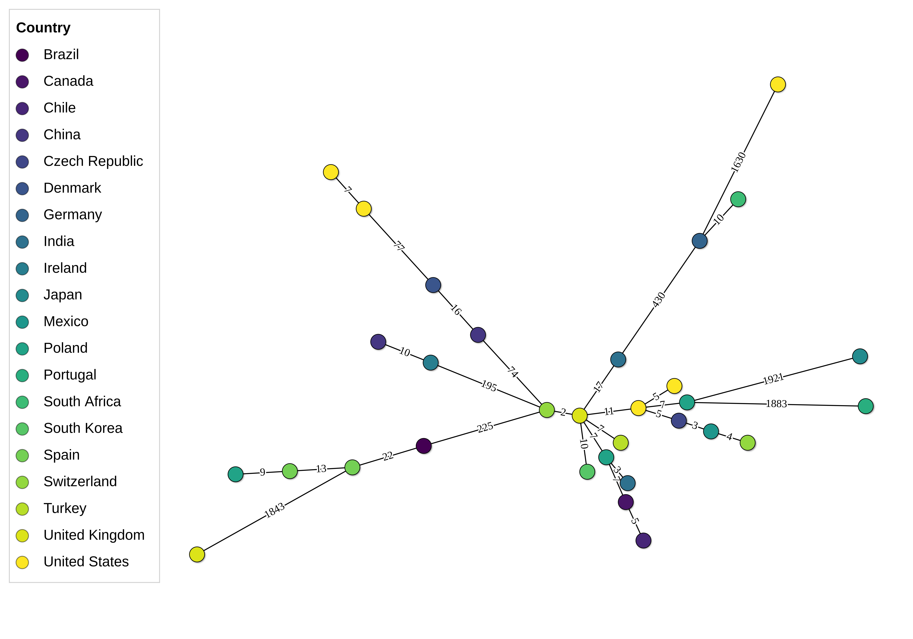

# Minimum Spanning Trees {#sec-mst}

The minimum spanning tree is PhyloTrace's principal network representation of
isolate relatedness and, for allelic-profile data, the standard representation
for outbreak analysis (@sec-concepts-mst). This chapter covers how to read one,
what each control does, and the choices that determine whether the picture you
get is a fair summary of the data.

## Reading an MST {#sec-mst-read}

Each **node** is a set of isolates that are indistinguishable from one another;
each **edge** joins the two closest nodes not already connected, and carries the
allelic distance between them (@fig-ui-mst). Together they form the most
economical set of links that still connects everything.

{#fig-ui-mst}

::: {.callout-important title="A node is a set of isolates, not always one isolate"}
By default, isolates that are **zero alleles apart** are drawn as a single node —
and this is transitive, so a chain of identical profiles collapses into one dot.
The node is drawn larger to show how many isolates it stands for (its area, not
its width, is proportional to the count), and hovering over it lists the members.

This matters when you read cluster sizes: a small MST with five nodes may
represent fifty isolates. When a variable is mapped onto colour, a multi-isolate
node is drawn as a **pie**, so a node containing isolates from three wards shows
all three rather than picking one.

**Zero is only the default, and you control it.** **Options > Collapsing >
Collapse branches ≤ (allelic distance)** raises that merging threshold to any
value you like, folding together nodes that differ by up to that many alleles
(@sec-mst-collapse). What "one node" means on screen is therefore a setting, not
a fixed property of the plot — so state the value you used when you report node
or cluster counts.
:::

Two further things about the picture are worth knowing before you read numbers
off it: node **size** and node **labels** both summarise rather than enumerate.
**Nodes > Size > Scale by duplicates** is what makes a node's area proportional
to its membership, and turning it off draws every node the same size regardless
of how many isolates it holds. Labels list the first few members and then count
the rest ("+7 more"); the hover tooltip always gives the full list.

## Generating the tree {#sec-mst-generate}

Building an MST requires comparing every pair of isolates, so it runs on
**Generate** (@sec-viz-generate). Two settings feed that computation and
therefore require a new Generate when changed:

- **The isolate selection**, made in the left sidebar under **Selection > Choose
  isolates** — which isolates are in the plot, including any staged peer sets
  picked in **Options > Imported typing results** (@sec-viz-staged).
- **Options > Missing values** — how missing allele calls are treated when
  computing distances (@sec-concepts-distance). The three choices are *Ignore for
  pairwise comparison*, *Omit loci with missing values* and *Treat missing as
  allele variant*, and the ⓘ icon beside the label explains each. This choice
  matters: with patchy assemblies, ignoring and omitting can give visibly
  different pictures. The same policy feeds the tree view, so the two always
  agree.

Everything else — colour, labels, node size, layout, clustering, collapsing —
redraws instantly.

## The control panel {#sec-mst-controls}

The MST's right-hand sidebar has six tabs (@fig-ui-mst-options).

| Tab | What it holds |
|---|---|
| **Options** | Missing values, imported sets, **Clustering**, **Cluster Options**, **Collapsing** |
| **Nodes** | Labels (show, source, font size), Size, Shadow |
| **Edges** | Length (mode, spread, long-branch handling), Labels |
| **Mapping** | The variable-to-colour picker and its layers |
| **Colors** | Text, nodes, edges and node borders, edge font, background |
| **Layout** | Rotation, legend, caption |

{#fig-ui-mst-options}

## Layout and edge length {#sec-mst-layout}

::: {.callout-important title="Positions are computed, not simulated — and not draggable"}
Node positions are calculated deterministically rather than settled by a physics
simulation in the browser. This matters for more than speed: in a spring-and-
repulsion layout the drawn distance between two isolates is a compromise between
their real distance and the crowding around them, so the picture is not a
faithful rendering of the data. Deterministic positions also mean the same
selection produces the same layout every time, so a figure you export today
matches the one you exported last week.

It also explains an interaction the plot deliberately refuses. You can **pan and
zoom** the canvas freely, and hovering a node shows its members — but **nodes
cannot be dragged**. The coordinates *are* the data: every branch is drawn at the
length its allelic distance earned, and moving a node by hand would break that
silently. Use **Layout > Rotation** and **Edges > Spread** to change how the
graph sits, not the mouse.
:::

Edge *length* on screen is a deliberate transform of allelic distance rather than
a raw proportion, and **Edges > Length** is where that transform is chosen.
Perfect proportionality fails in practice: a collection with one distant outlier
at 3,000 alleles would compress everything else into a single point. PhyloTrace
holds the typical edge at a legible length and uses proportional lengths only
while the longest edge stays within a readable ratio.

Four controls sit in that section:

| Control | Effect |
|---|---|
| **Length** | The transform itself — whether edge length carries the distance at all |
| **Spread** | How far apart the whole graph is drawn |
| **Shorten long branches** | Caps outlier branches instead of drawing them to scale. Applies only while length carries the distance |
| **Cap at (x median)** | Where that cap falls. A branch longer than this multiple of the median is drawn **dashed** at the capped length, with its true distance still on the label |

**Read the numbers on the edges, not the pixels between the nodes** — and treat a
dashed edge as an explicit statement that its drawn length is not to scale
(@fig-ui-mst-nodes-edges).

{#fig-ui-mst-nodes-edges}

## Clustering {#sec-mst-cluster}

**Options > Clustering** groups nodes that lie within a chosen allelic distance
of each other, and shades each group as a blob behind its members.

| Control | Notes |
|---|---|
| **Show clusters** | On by default; turns the whole feature off |
| **Threshold (allelic distance)** | The distance within which nodes count as one cluster |
| Palette | Which colour scale the cluster blobs take |

**Cluster Options**, the section below, governs how the blobs are drawn —
**Width**, **Opacity (%)**, **Label size (0 = off)** and **Label Colors**, which
tints each label to match its blob.

::: {.callout-important title="The default threshold comes from the scheme"}
The threshold defaults to the **cluster distance published with your scheme**,
where the repository provides one — the same number shown in **Database Browser >
cgMLST Overview > Scheme Info** (@sec-schemes-scheme-info). That is what makes
the clusters you call comparable with standard cluster nomenclatures rather than
being a number you invented.

You can of course change it — a different threshold is a legitimate analytical
choice — but if you report clusters, report the threshold you used with them.
:::

## Collapsing: making a large MST readable {#sec-mst-collapse}

A cgMLST MST of a few hundred isolates has a node for nearly every one of them,
and at that size the picture stops carrying information. **Options > Collapsing >
Collapse branches ≤ (allelic distance)** is the standard remedy: every branch at
or below the value you set is contracted, and the nodes it joined become one.

It is the same operation the plot already performs at distance zero
(@sec-mst-read), generalised to any threshold — so the merged node behaves
exactly like a zero-distance node. It counts its members, sizes itself by them,
draws them as a pie when a variable is mapped, and lists them on hover.

::: {.callout-important title="Collapsing is a display choice with real consequences"}
A collapsed MST is a **different picture of the same data**, not a filtered one:
no isolate is dropped, but nodes that were distinguishable are no longer drawn
apart. Published cgMLST figures routinely collapse at 50, 100 or 150 alleles
depending on what the figure is about.

The value therefore belongs in any figure legend you write, alongside the cluster
threshold. Reading "twelve nodes" off a plot collapsed at 100 means something
very different from twelve nodes at the default 0.
:::

The field starts at **0**, which collapses nothing. As soon as it bites, a line
under it reports what happened — *"37 branches collapsed, leaving 24 nodes."* —
because that count is not visible anywhere else on the canvas. Set it back to 0
and the note disappears, which is equally informative: the control is doing
nothing.

Unlike most appearance controls, collapsing changes which nodes exist, so the
network is rebuilt rather than nudged. Expect a brief redraw rather than an
instant one on a large plot. It still needs no **Generate** — the distances
behind it are unchanged.

## Colouring and labelling {#sec-mst-colour}

Node fill is the MST's mapping channel, and **Mapping > Map a variable** is where
you choose what it shows (@sec-viz-mapping). Categorical variables become
discrete colours, with multi-isolate nodes drawn as pies; continuous variables
become a gradient, and a node holding several isolates takes their mean.

**Nodes > Labels** governs the text on the nodes:

- **Show node labels** turns them off entirely — worth doing on a dense graph.
- **Label source** chooses what they say: the isolate name, or any metadata field
  or custom variable.
- **Font size** adjusts them; the value PhyloTrace sets on Generate is fitted to
  the number of nodes.

Labels list a few member isolates and then "+N more" when a node holds many, so
they stay readable; the hover tooltip gives the full membership.

The **Colors** tab holds the fixed colours — text, unmapped nodes, edges and node
borders (deliberately one setting, so the linework stays consistent), the edge
font, and the background, which can be made **transparent** for dropping the
figure onto a slide.

## Export {#sec-mst-export}

The MST is drawn in the browser, so **Export Plot > Save plot** offers PNG, JPEG
and **Interactive HTML** — the last a single file a colleague can open, pan, zoom
and hover in without PhyloTrace. The raster export is a genuine re-render at the
larger size rather than a screenshot, sized by a **Target width (px)** rather
than a DPI (@sec-viz-export).

::: {.callout-tip title="Concept — the MST is a summary, not a proven history"}
An MST shows *one* cheapest way to connect the isolates. When several links are
tied — which is common — the choice among them is arbitrary, and the MST cannot
represent reticulation (a bacterium's history is not always tree-shaped). It is
an accurate summary of pairwise closeness, useful for identifying clusters and
plausible transmission chains, but it is not a proven genealogy.
:::

## Chapter summary

- Nodes are sets of isolates that the collapse threshold treats as one — zero
  alleles apart by default — sized by membership and drawn as pies when coloured;
  edges carry allelic distances.
- The isolate selection and **Options > Missing values** require a Generate;
  everything visual, including both thresholds, redraws instantly.
- Positions are deterministic, and edge length is a legible transform of distance
  — read the edge numbers, not the pixel gaps, and treat a dashed edge as capped.
- **Options > Clustering > Threshold** defaults to the distance published with
  your scheme; **Options > Collapsing** merges nodes up to a distance you choose
  and reports how many branches it folded. Report both values with any figure.
- Export is a genuine high-resolution redraw, or interactive HTML.

The same distances, drawn as a branching genealogy, are @sec-trees.
