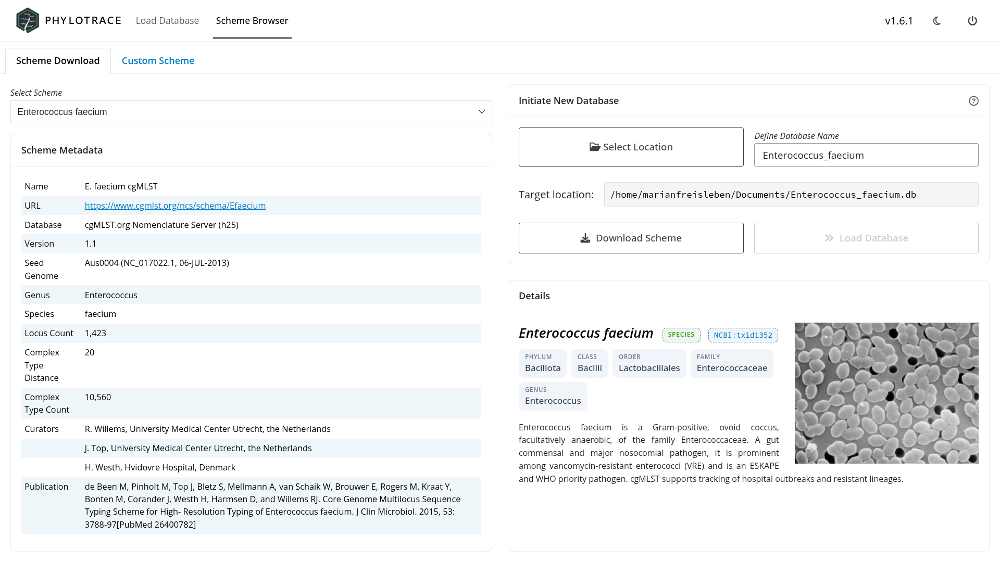
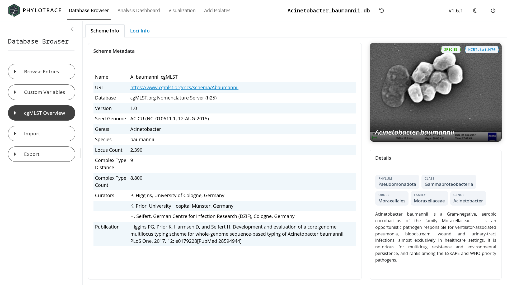
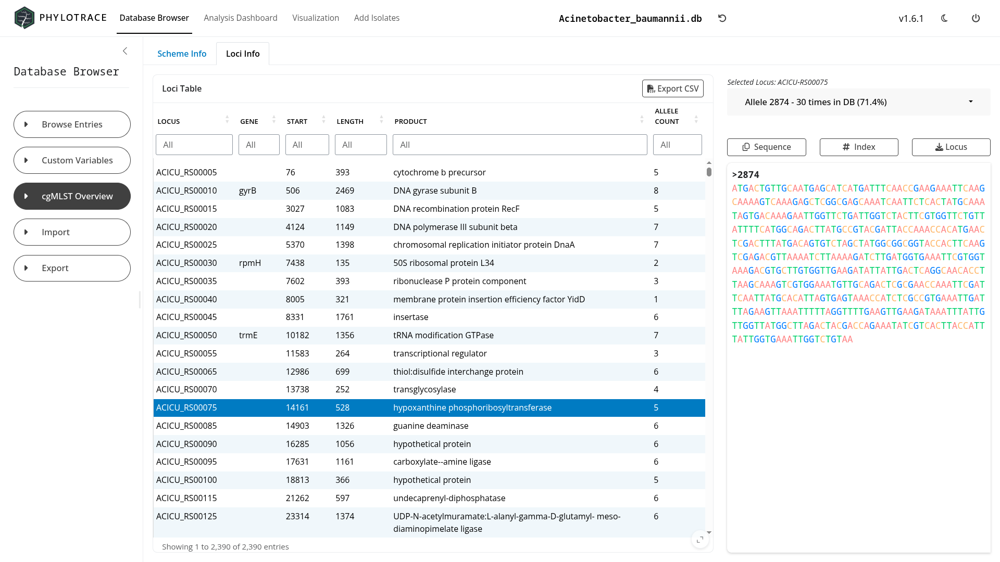

# Scheme Management {#sec-schemes}

Before an isolate can be typed, PhyloTrace needs a **scheme**: the definition of
which loci to read, what to call them, and what allele sequences are already
known. This chapter covers choosing and downloading a scheme into a new database,
what a scheme contains, and how to inspect the one your database was built from.

::: {.callout-tip title="Concept — what a cgMLST scheme is"}
A cgMLST **scheme** is a species-specific catalogue with three parts: the **set
of core-genome loci** to type (often several hundred to a few thousand genes,
depending on the species), a **nomenclature** that
gives every known allele at each locus a stable identifier, and a **reference
(seed) genome** the loci are defined against. Public repositories curate these
so that everyone typing, say, *Listeria monocytogenes* uses the same targets and
the same allele numbers — which is what makes results comparable between labs.
PhyloTrace downloads cgMLST schemes from cgMLST.org [@cgmlstorg]. The
accompanying classical 7-gene MLST scheme is resolved separately, against
PubMLST and Institut Pasteur [@pubmlst] (@sec-typing-classical).
:::

## The Scheme Browser {#sec-schemes-browser}

The **Scheme Browser** tab is where you pick a species, review the scheme
available for it, and download that scheme into a **new** database. It opens on
its **Scheme Download** tab — a second tab, **Custom Scheme**, is reserved for a
feature still to come — and lays that screen out in four regions:

| Region | What it holds |
|---|---|
| **Select Scheme** (top left) | A searchable dropdown of every species cgMLST.org publishes a scheme for |
| **Scheme Metadata** (below it) | The published summary of the selected scheme |
| **Initiate New Database** (top right) | Where the new file goes, and the two action buttons |
| **Details** (bottom right) | A photograph, the taxonomy and a short description of the organism |

The Details card is there so you can confirm you are looking at the right
organism before committing to a download of several thousand allele sequences
(@fig-ui-scheme-browser).

{#fig-ui-scheme-browser}

::: {.callout-important title="The Scheme Browser creates databases; it does not open them"}
The only database the Scheme Browser can hand over to the rest of the app is the
one it has *just downloaded* — its **Load Database** button becomes available
after a successful download and opens that new file. To open a database that
already exists, use the **Load Database** tab instead (@sec-data-open); that is
the only place an arbitrary existing file can be selected.
:::

## Creating a database from a scheme {#sec-schemes-download}

Downloading is what creates the database, in three steps you drive from the
panel (@fig-scheme-download):

1. **Choose the species** in **Select Scheme**. The list is long, so type into
   the search box at the top of the dropdown rather than scrolling. Scheme
   Metadata and Details fill in as soon as a species is picked.
2. **Choose where the database goes.** **Select Location** opens a folder
   chooser; the chosen folder is then shown under *Target location*, and a name
   field appears beside it. The name is restricted to letters, digits, hyphens
   and underscores (@sec-data-naming), and PhyloTrace will warn you rather than
   overwrite an existing file.
3. **Download Scheme.** The button is disabled until both a scheme and a
   destination are set. The alleles are fetched, together with the scheme's
   published summary — locus count, seed genome, and the repository's own
   cluster-distance threshold — and the target locus list. All of it is written
   into the new database file, so no later step ever needs the network again.

Downloading a full cgMLST scheme is a substantial transfer and takes minutes
rather than seconds. When it reports success, the **Load Database** button beside
it becomes enabled; clicking it opens the new file and the workspace tabs appear.

::: {.callout-tip title="The ⓘ button on the card says the same thing"}
The question-mark icon in the **Initiate New Database** header repeats these
steps in two sentences. It is the fastest reminder if you come back to this
screen after a few months.
:::

```{mermaid}
%%| label: fig-scheme-download
%%| fig-cap: "Creating a database: pick a species, download its scheme, and open the resulting file."
flowchart LR
  S["Pick a species"] --> T["Choose folder + name"]
  T --> D["Download Scheme<br/>alleles · scheme summary · target loci"]
  D --> DB[("New database file")]
  DB --> L["Load Database<br/>→ workspace opens"]
```

::: {.callout-important title="One database per scheme"}
A database is created around one scheme and keeps it for life (@sec-data-scheme).
Working on a second species means creating a second database — there is no way to
add a different scheme to an existing file, and no reason to want one, since
allele profiles from different schemes are not comparable.
:::

## Inspecting the scheme: the cgMLST Overview panel {#sec-schemes-inspect}

**Database Browser > cgMLST Overview** gives two read-only views of the scheme
your database was built from, on two tabs.

### Scheme Info {#sec-schemes-scheme-info}

**Scheme Metadata** holds the published summary: organism, number of loci, the
seed genome the scheme is defined against, and the repository's cluster-distance
threshold. That last number is the default PhyloTrace offers when you cluster a
minimum spanning tree (**Visualization > Options > Clustering > Threshold**,
@sec-mst-cluster), which is what makes your cluster calls comparable with
published nomenclatures. Beside it, the same species photograph and **Details**
card you saw in the Scheme Browser (@fig-ui-scheme-info).

{#fig-ui-scheme-info}

### Loci Info {#sec-schemes-loci-info}

The **Loci Table** lists one row per target locus with six columns — *Locus*,
*Gene*, *Start*, *Length*, *Product* and *Allele Count* (@fig-ui-loci-info). The
allele count is the number of distinct alleles seen for that locus **in your
database**, not in the public scheme, so it is a direct measure of how much
diversity your own collection carries at that gene. **Export CSV** in the card
header writes the whole table out.

Selecting a row, or picking one from the **Select locus from table** dropdown
below the table, loads that locus's alleles into the panel on the right, with the
DNA sequence colour-coded by base. Three buttons act on the displayed allele:

| Button | What it does |
|---|---|
| **Sequence** | Copies the displayed allele's sequence to the clipboard |
| **Index** | Copies the allele's identifier |
| **Locus** | Downloads *every* allele of this locus as a FASTA file |

{#fig-ui-loci-info}

This is the quickest route from "how variable is this gene in my collection?" to
a FASTA file you can take elsewhere, without leaving the app.

::: {.callout-important title="The species name shown is the scheme's, not a taxonomic call"}
The organism shown in Scheme Info comes from the scheme you downloaded. It
describes the *reference data* your isolates were typed against — it is not an
identification of the isolates themselves. If you type an assembly of a different
species against this scheme, the scheme name will not change to reflect it, but
the allele calls will be poor; the completeness figures reported after typing are
the signal to watch (@sec-typing).
:::

## Chapter summary

- A scheme defines the loci, the allele nomenclature and the reference genome for
  a species; PhyloTrace pulls cgMLST schemes from cgMLST.org, and resolves the
  classical MLST scheme separately, from PubMLST and Institut Pasteur.
- Downloading a scheme is what creates a database: **Select Scheme**, **Select
  Location** plus a name, then **Download Scheme**. The scheme summary and target
  loci are stored inside the file so later work needs no network.
- The Scheme Browser can open only the database it has just created; existing
  databases are opened from the Load Database tab.
- **cgMLST Overview** shows the scheme summary (**Scheme Info**) and the
  per-locus allele counts in your own database (**Loci Info**), and exports the
  table as CSV or a locus's alleles as FASTA.

@sec-typing describes what happens when assemblies are typed against the scheme.
