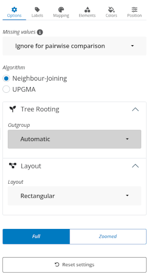
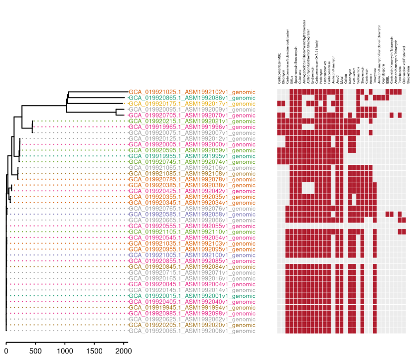

# Phylogenetic Trees (Neighbour-Joining & UPGMA) {#sec-trees}

The tree view draws the same allelic distances as a branching genealogy rather
than a network. This chapter covers the choice between the two algorithms, how to
read the resulting figure, and how to annotate it with metadata. The conceptual
difference between the algorithms is in @sec-concepts-trees.

## Choosing an algorithm {#sec-trees-algo}

**Options > Algorithm** offers **Neighbour-Joining** [@saitou1987nj] and
**UPGMA** [@sokal1958upgma]. Both are built from the same distance matrix the MST
uses (@sec-mst), so the two views of one dataset never disagree about how far
apart two isolates are.

| | Neighbour-Joining | UPGMA |
|---|---|---|
| Assumes a constant rate of change | No | Yes |
| Tip alignment | Tips end at different depths | All tips end level (ultrametric) |
| Best for | Lineages that may be unevenly divergent | Showing nested clustering |

::: {.callout-tip title="Concept — which to use, and what disagreement means"}
Use **UPGMA** when you want a hierarchical clustering picture and the isolates
are expected to evolve at similar rates. Use **Neighbour-Joining** when some
lineages may be more divergent than others and should not be forced level.

If the two trees disagree substantially, that disagreement is itself informative:
it usually indicates uneven rates of change, in which case the
Neighbour-Joining tree is the more reliable interpretation.
:::

Switching algorithm changes the computation, so it requires a **Generate**
(@sec-viz-generate) — as do the isolate selection and **Options > Missing
values**.

## The control panel {#sec-trees-controls}

The Tree's right-hand sidebar has six tabs (@fig-ui-tree-controls).

| Tab | What it holds |
|---|---|
| **Options** | Missing values, imported sets, **Algorithm**, **Tree Rooting**, **Layout** |
| **Labels** | Isolate Labels (show, source, size); Allelic Distance (axis, branch numbers, scale bar) |
| **Mapping** | The variable picker and its layers, plus the **Heatmaps** section |
| **Elements** | Tip Points, Clade Highlight, Legend, Root edge |
| **Colors** | Lines/text, background, tip label, allelic distance, tip point |
| **Position** | Aspect ratio, vertical and horizontal shift, zoom |

{#fig-ui-tree-controls}

Below the tabs sits a **Full / Zoomed** toggle, which switches between fitting the
whole tree into the panel and scrolling through it at the size the *Position*
controls set — the way to read a several-hundred-tip tree without shrinking its
labels to nothing.

## Reading the tree {#sec-trees-read}

@fig-ui-tree shows a rectangular tree annotated with tip points, a colour
mapping and a gene heatmap panel beside the tips.

{#fig-ui-tree}

::: {.callout-important title="Branch lengths are allele differences"}
Branch lengths are in the raw units of the distance matrix — numbers of differing
alleles — the same units the MST writes on its edges. A pair reported "3272
apart" reads identically in both views.

**Labels > Allelic Distance** governs how that is shown, with three independent
switches: a **Distance axis** (on by default) drawn to the same scale as the
branches, so you can measure relatedness off the figure; **Show on branches**,
which prints the numbers on the branches themselves; and a **Scale bar** as a
compact alternative to the full axis.

Which branches get a printed number is not a choice you make — a branch is
labelled when it is wide enough on screen to hold the number and no other label
shares its row. Short branches are left unlabelled to keep the figure readable,
not because their length is unknown.
:::

### Rooting and layout {#sec-trees-layout}

**Options > Tree Rooting > Outgroup** decides where the tree is rooted. It
defaults to **Automatic**; pick an isolate to root on it instead, which is the
right move when you have a known outgroup or a reference strain in the selection.

**Options > Layout** offers six forms in two groups:

| Group | Layouts | Use |
|---|---|---|
| **Linear** | Rectangular, Roundrect, Slanted, Ellipse | The conventional forms; Rectangular is the default and the safest for publication |
| **Circular** | Circular, Inward | Pack large trees into a much smaller area, at some cost in tip readability |

Font sizes, spacing and element scaling adapt automatically to the number of
tips on **Generate**, so a 12-tip and a 400-tip tree are both legible without
manual adjustment — the *Labels* and *Position* sliders start from that fitted
value rather than from a fixed one.

## Annotating with metadata {#sec-trees-annotate}

The tree provides its greatest analytical value when metadata is laid over it.
**Mapping > Map a variable** offers four channels, assigned automatically from
the variable you pick (@sec-viz-mapping):

- **Tip-label colour**
- **Tip-point colour**
- **Tip-point shape**
- **Tile strips** beside the tips

Tip points have their own controls under **Elements > Tip Points** — whether to
show them at all, their **Shape**, **Opacity** and **Size**. Note that mapping a
variable onto the points locks the show switch on; the panel says so rather than
leaving a disabled control unexplained.

**Elements > Clade Highlight** is the other annotation route: switch on **Toggle
node view** to show the tree's internal node numbers, pick one or more under
**Nodes**, and the clade descending from each is shaded in the **Highlight
color**. This is how you mark "this is the outbreak clade" on a figure.

### Panels beside the tree {#sec-trees-panels}

Beyond the four channels, whole **panels** can sit alongside the tree in register
with its tips, under **Mapping > Heatmaps**. Two are offered:

| Panel | What it draws |
|---|---|
| **Drug classes, virulence and stress** | One column per drug class or virulence/stress group, found or not |
| **Individual genes** | One column per gene, shaded by how confident the call is |

Each has its own column picker, so you can restrict a panel to the classes or
genes that matter rather than drawing all of them. This is usually the figure
worth putting in a report: the tree shows who is related to whom, and the panel
beside it shows what that means clinically (@fig-tree).

```{mermaid}
%%| label: fig-tree
%%| fig-cap: "The tree combines the allelic distances with metadata: the branching structure comes from the profiles, the colours, shapes and side panels from the metadata and custom variables."
flowchart LR
  D["Allelic distances<br/>(same as the MST)"] --> B["Neighbour-Joining<br/>or UPGMA"]
  B --> R["Tree figure"]
  M["Metadata +<br/>custom variables"] --> A["Tip colour · shape ·<br/>tile strips · panels"]
  A --> R
```

## Export {#sec-trees-export}

The tree is drawn on the server, so **Export Plot > Save plot** offers **PDF** and
**SVG** — vector, with no resolution to lose — as well as PNG, JPEG and TIFF at
whatever DPI you request (@sec-viz-export). This is the export route that goes
straight into a manuscript.

## Chapter summary

- Neighbour-Joining and UPGMA are built from the same distances as the MST;
  **Options > Algorithm** switches between them and requires a Generate.
- Branch lengths are allele differences; **Labels > Allelic Distance** turns the
  axis, the branch numbers and the scale bar on independently, and only branches
  wide enough to be legible carry a printed number.
- **Options > Tree Rooting** sets the outgroup; **Options > Layout** offers four
  linear and two circular forms, and sizing adapts to the tip count.
- Metadata maps onto tip colour, shape and labels via **Mapping**, plus tile
  strips, **Clade Highlight**, and the two **Heatmaps** panels including an AMR
  gene matrix.
- Export is vector (PDF/SVG) or high-DPI raster — publication quality directly.

Next: the two plot types that need no genetics at all — the epidemic curve
(@sec-epicurve) and the map (@sec-map).
