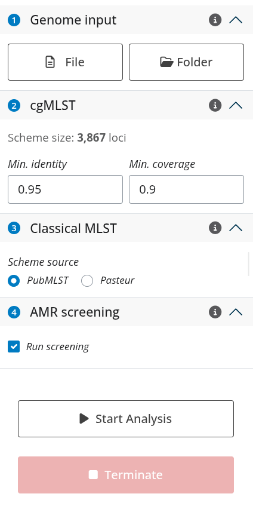
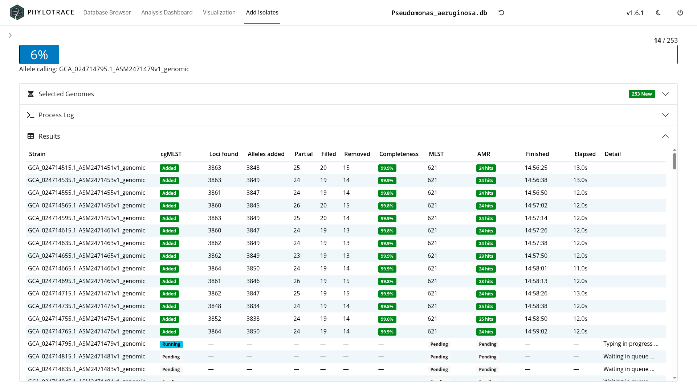

# Allelic Typing (cgMLST) {#sec-typing}

Typing is the central step in PhyloTrace: it turns a whole-genome assembly into
an allele profile in your database. This chapter follows one assembly through
that process — what you submit, what happens to it, what the results mean, the
classical sequence type resolved alongside, and the record kept so that every
call can be traced back to the software that produced it.

::: {.callout-tip title="Concept — how in-silico typing works"}
Given a scheme (@sec-schemes) and an assembly, the typer compares the assembly
against each locus's known alleles. At a locus, three things can happen: the
assembly matches a **known allele** exactly (its identifier is recorded); it
matches the locus but with a **new sequence** (a *novel* allele — it is recorded
and given a new identifier); or the locus is absent, fragmented, or below the
quality thresholds (a *missing* or *partial* call). Repeating this across all core
loci yields the isolate's profile.
:::

## The Add Isolates panel {#sec-typing-ui}

The **Add Isolates** tab accepts one or more assembly FASTA files (`.fasta`,
`.fa` or `.fna`), shows live progress as each is typed, and reports the outcome
per isolate. The isolate's name is taken from the filename, so name your files
the way you want the isolates to be named — using letters, digits, hyphens and
underscores only (@sec-data-naming).

### The sidebar: the pipeline, one step at a time {#sec-typing-steps}

The left sidebar *is* the pipeline. It holds four numbered sections in the order
a genome runs through them, and each carries a **ⓘ icon** that opens a full
explanation of that step in a dialogue.

| Step | Controls | Default |
|---|---|---|
| **1 · Genome input** | **File** (one assembly) and **Folder** (a whole directory of them) | — |
| **2 · cgMLST** | **Min. identity**, **Min. coverage**; the scheme's locus count is shown above them | 0.95 / 0.9 |
| **3 · Classical MLST** | **Scheme source**: PubMLST or Pasteur | PubMLST |
| **4 · AMR screening** | **Run screening** | on |

{#fig-ui-typing-sidebar}

::: {.callout-important title="The two thresholds in step 2 belong to allele calling"}
**Min. identity** and **Min. coverage** are fractions between 0 and 1, and they
govern when a match to a locus counts as a call at all. Lowering them recovers
loci from a fragmented assembly at the risk of accepting a poor match; raising
them is stricter and will lower completeness (@sec-typing-results). They are
recorded per isolate in the provenance record (@sec-typing-provenance), so a
batch typed at non-default thresholds stays identifiable later.

Both apply to **cgMLST only**. Classical MLST and the AMR screen have their own
internal criteria and are unaffected.
:::

The **Scheme source** in step 3 chooses which public repository the 7-gene scheme
is resolved against. PubMLST is the default; Pasteur maintains the authoritative
scheme for a number of organisms (notably *Listeria* and *Klebsiella*), so pick
whichever your reporting context expects — the two number their sequence types
differently and the numbers are not interchangeable.

### Running a batch {#sec-typing-run}

**Start Analysis** is disabled until at least one assembly is selected. Pressing
it first runs a quick checking pass over the files — fingerprinting each and
comparing it with the database (@sec-typing-hashing) — and then begins typing.
**Terminate**, in red below it, stops a run in progress and stays clickable even
while everything else is locked (@sec-app-typing-parallel).

Under the buttons, a **Typing progress** bar reports percentage complete, and a
status line beneath it names what the run is currently doing.

### Choosing which of the selected genomes actually run {#sec-typing-selection}

The main area holds three collapsible sections, one open at a time.

**Selected Genomes** lists the assemblies you picked, with a toolbar above them:

| Button | Effect |
|---|---|
| **All** / **None** | Tick or clear every row in the list |
| **Exclude selected** | Drop the ticked rows from this run without re-picking the folder |
| **Include selected** | Put excluded rows back |

This is how you type a folder minus a few files: point step 1 at the folder, then
exclude what you do not want. Excluded genomes stay visible, marked in their
status column, rather than disappearing.

**Process Log** is the raw output of the underlying tools — the place to look
when something failed and the summary does not say enough. **Results** is the
table described below.

Typing runs alongside the rest of the app, so you can keep browsing and plotting
while it works, and new isolates appear in the other panels as they land
(@sec-app-typing-parallel).

## What happens to each assembly {#sec-typing-pipeline}

Each file goes through the same sequence of steps, in order. They are genuinely
sequential — the cgMLST call does not launch the classical MLST call, and neither
launches the AMR screen; each simply follows the previous one on the same file.

**Before the run starts,** PhyloTrace fingerprints each assembly and compares it
against what is already in the database, so that duplicates are caught before any
work is done (@sec-typing-hashing). It also resolves and builds the matching
classical MLST reference once for the whole run (@sec-typing-classical).

**Then, for each assembly in turn:**

1. **cgMLST allele calling** — the assembly is compared against the scheme and an
   allele is called at every locus. This is the long step, and the one that
   produces the allele profile.
2. **Classical MLST** — the same assembly is searched against the 7-gene scheme
   to obtain a sequence type (@sec-typing-classical).
3. **AMR screening** — the assembly is screened for resistance, virulence and
   stress determinants (@sec-amr).

Steps 2 and 3 are **best-effort**: if a classical scheme could not be resolved
for the species, or the AMR screen fails or times out, that step is skipped or
reported as failed and the cgMLST profile is unaffected. A typing run never loses
its allele calls because a companion step went wrong.

**After each assembly,** the results are read back and written into your
database: the sequence type, the AMR findings, the assembly fingerprint, and the
provenance record (@sec-typing-provenance). New allele sequences are given their
content fingerprints so the data stays comparable with other labs
(@sec-concepts-hashing).

```{mermaid}
%%| label: fig-typing
%%| fig-cap: "What happens to one assembly. Solid arrows are the order in which steps run; dotted arrows show what each step adds to your database. Steps 1–3 run one after another on the same file — none of them starts the next."
flowchart TB
  subgraph PREP["Before the run"]
    F["Assembly file<br/>(.fasta / .fa / .fna)"] --> H["Fingerprint the assembly"]
    H --> CK["Check against the database:<br/>new · identical re-type · duplicate"]
    CK --> CC["Resolve and build the<br/>classical MLST reference<br/><i>(once per run)</i>"]
  end

  CC --> S1

  subgraph RUN["For each assembly, in order"]
    S1["Step 1 · cgMLST allele calling"]
    S2["Step 2 · Classical MLST search<br/><i>best-effort</i>"]
    S3["Step 3 · AMR screening<br/><i>best-effort</i>"]
    S1 --> S2 --> S3
  end

  S3 --> RB["Results read back<br/>and stored"]

  S1 -. adds .-> T1[("Allele profile<br/>+ new allele sequences")]
  RB -. adds .-> T2[("Sequence type (ST)")]
  RB -. adds .-> T3[("AMR / virulence / stress findings")]
  RB -. adds .-> T4[("Assembly fingerprint")]
  RB -. adds .-> T5[("Typing provenance record")]
```

## Reading the results {#sec-typing-results}

The **Results** section fills in row by row as the run proceeds — one row per
assembly, thirteen columns. Every column header carries a hover tooltip
explaining it; the table below is the same information, gathered.

| Column | What it reports |
|---|---|
| **Strain** | The assembly's filename without its extension — the isolate's name |
| **cgMLST** | How allele calling ended: *Added*, *Duplicate*, *Incompatible* (no core gene matched) or *Error* |
| **Loci found** | Scheme loci located in the assembly |
| **Alleles added** | Loci whose allele was stored for this isolate |
| **Partial** | Loci matched over less than their full length |
| **Filled** | Partial loci completed from the assembly and kept |
| **Removed** | Loci dropped for low coverage or a failed coding-sequence test |
| **Completeness** | Share of the scheme's loci called — see below |
| **MLST** | The classical sequence type, or *Novel* / *Partial* / *Ambiguous* |
| **AMR** | The resistance screen's outcome and its number of hits |
| **Finished**, **Elapsed** | When the isolate's last step ended, and how long all three took |
| **Detail** | What the isolate is doing now, or why it was not added |

{#fig-ui-typing-results}

Completeness is colour-coded as a badge so a bad isolate is visible at a glance:
**green at 99 % and above**, **amber from 90 %**, and **red below 90 %**.

::: {.callout-important title="Completeness is your first quality check"}
A good assembly of the right species typically calls the great majority of the
scheme's loci. A markedly low completeness usually means one of three things: the
assembly is fragmented or low-coverage, it is contaminated, or it is not the
species the scheme is for. Isolates with poor completeness will sit far from
everything else on a distance-based plot for reasons that have nothing to do with
epidemiology, so it is worth checking completeness before drawing conclusions
from an MST or a tree.
:::

## Classical MLST alongside cgMLST {#sec-typing-classical}

While cgMLST types the core genome, PhyloTrace also resolves the classical
**7-gene sequence type** for each isolate and stores it beside the profile. The
ST is low resolution — many unrelated isolates share one — but it is the currency
most of the older literature and many national reporting schemes are written in,
so having it alongside the cgMLST profile is useful for communicating results.

The 7-gene scheme is looked up against the repository chosen in **step 3 ·
Classical MLST** [@pubmlst], matched to the genus of your cgMLST scheme, and
downloaded once per typing run.

::: {.callout-important title="When there is no ST"}
An isolate can end up with no sequence type for legitimate reasons: the species
may have no classical scheme in the public repositories, the isolate may carry a
new allele combination that has not been assigned an ST yet, or a locus may be
genuinely absent. A missing ST is not a failed typing run — the cgMLST profile,
which is what the analyses in Part IV use, is unaffected.

The **MLST** column distinguishes these outcomes rather than leaving the cell
blank. *Novel* means a complete but unregistered profile; *Partial* means some
loci were not called; *Ambiguous* means several STs fit the profile. A sequence
type shown with a **star** comes from the scheme's own profile table, where the
uncalled locus is recorded as genuinely absent.
:::

## Duplicate detection {#sec-typing-hashing}

Every assembly is fingerprinted from its own sequence content before typing, and
compared with the fingerprints already recorded. Each incoming file is classified
as:

- **New** — content not seen before.
- **Identical re-type** — the same assembly, under the same isolate name, that
  has already been typed.
- **Duplicate** — the same assembly content under a *different* name, or a name
  that is already taken.

::: {.callout-tip title="Concept — a fingerprint that flags, never blocks"}
The assembly fingerprint is a *one-way* indicator. A match proves two runs used
the byte-identical file; a mismatch proves nothing — re-assembling the same reads
with a different assembler produces a different file and therefore a different
fingerprint. PhyloTrace therefore uses it to *flag* likely duplicates for your
attention, and never as a hard rule that could block a legitimate re-analysis
(@sec-concepts-hashing).
:::

## Provenance: how each isolate was typed {#sec-typing-provenance}

As the run proceeds, PhyloTrace records one row per isolate describing exactly
how it was typed: which assembly (by fingerprint), which cgMLST scheme and
version, the seed genome and the identity/coverage thresholds used, which
classical scheme, how the AMR screen went, and the version of every tool
involved.

::: {.callout-tip title="Concept — why provenance matters"}
Typing results are only as interpretable as the reference data behind them. If
you compare isolates typed a year apart, or take over a database from a
colleague, provenance is what tells you whether the two sets of calls were made
against the same scheme version by the same tool versions. It is also the methods
detail a publication or an accreditation audit will ask for.

The scheme details are stored as a **snapshot of what was true at typing time**,
so refreshing a scheme later can never rewrite the history of an earlier call.
:::

## Chapter summary

- **Add Isolates** types FASTA assemblies while the rest of the app stays usable;
  isolate names come from the filenames.
- The sidebar is the pipeline: **Genome input**, **cgMLST** (Min. identity /
  Min. coverage), **Classical MLST** (PubMLST or Pasteur) and **AMR screening**,
  then **Start Analysis**. **Terminate** stays available throughout.
- **Selected Genomes** lets you exclude individual files from a folder before
  running; **Process Log** and **Results** report what happened.
- Each assembly goes through three sequential steps — cgMLST allele calling, then
  classical MLST, then AMR screening — with the last two best-effort.
- Completeness is the first quality signal to check on a new isolate; its badge
  turns amber below 99 % and red below 90 %.
- Assemblies are fingerprinted so duplicates and re-types are flagged, never
  blocked.
- Every isolate gets a provenance record naming the scheme, thresholds and tool
  versions that produced its calls.

AMR screening runs as part of the same typing run — that is @sec-amr.
