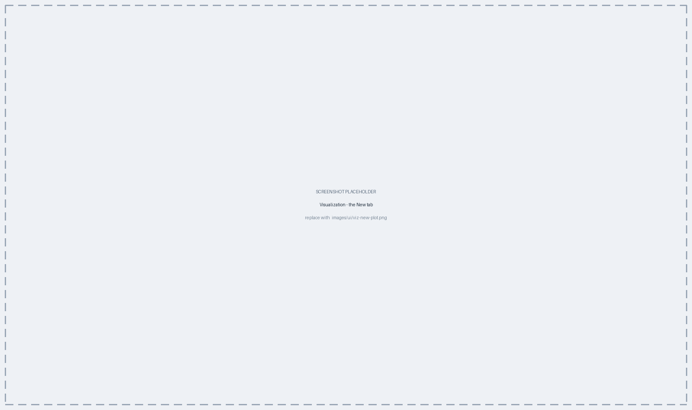
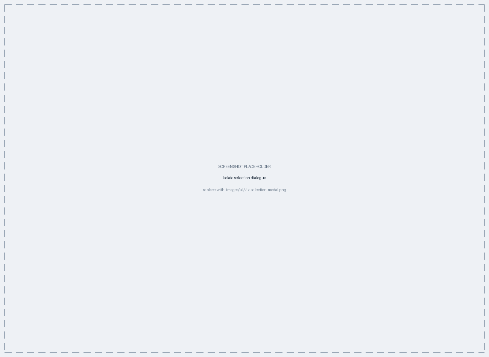
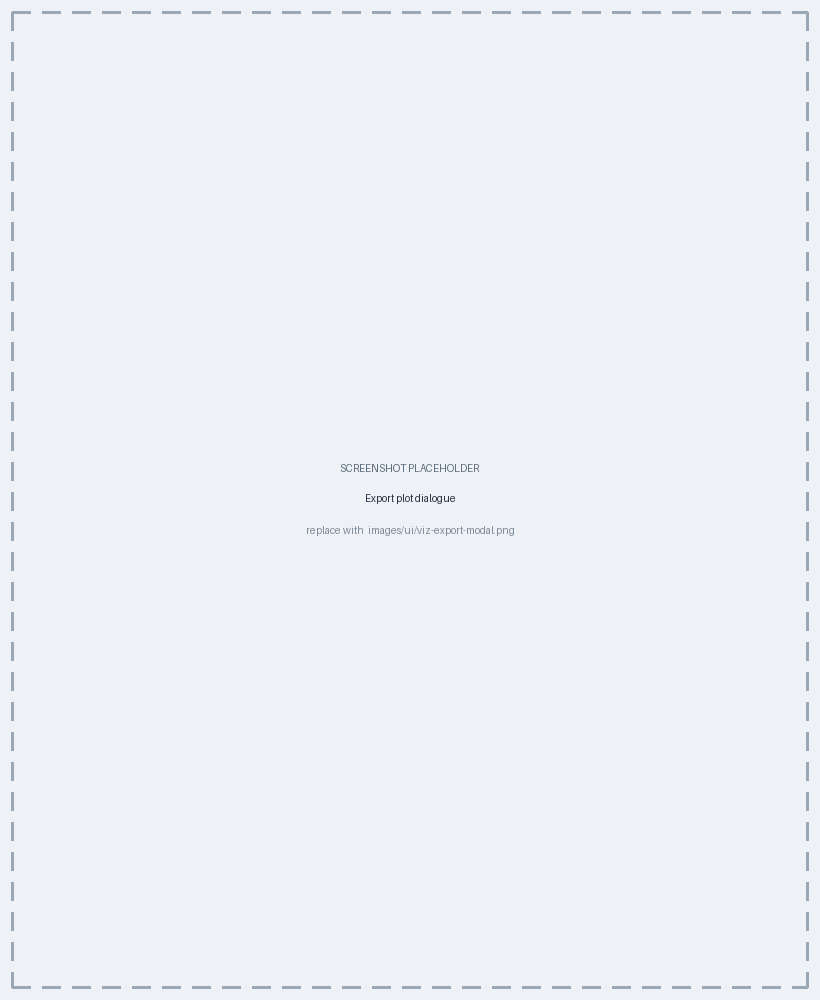

# The Visualization Workspace {#sec-visualization}

The Visualization tab is a workspace, not a single plot. It lets several plots —
including several of the same kind — live side by side, each with its own
controls, its own isolate selection and its own Save target. This chapter covers
what every plot has in common: how tabs work, when a plot recomputes, how a
variable becomes a colour, and how to get a publication-quality figure out. The
five plot types themselves are @sec-mst, @sec-trees, @sec-epicurve, @sec-map and
@sec-amr-heatmap.

## Creating a plot {#sec-viz-tabs}

The workspace has a permanent **New** tab — a plus sign, at the far left of the
tab strip — plus one tab per plot you have made. The New tab is the creator form,
and it has three parts:

1. **A row of five tiles** across the top, one per plot type, in this order:
   **MST**, **Tree**, **Map**, **Epi** and **AMR**. Clicking one selects it.
2. **A description card** on the left, which changes with the selection. It says
   what the type draws, and carries two badges: either *Pairwise allelic
   distances* and *Staged peer isolates can be included* (MST and Tree), or
   *Reads isolate metadata directly* and *Local isolates only* (the other three).
3. **A form card** on the right with a **Plot name** field — free text, so
   spaces and punctuation are fine — and **Initiate plot**.

{#fig-ui-viz-new}

Plot names default to *Plot 1*, *Plot 2* and so on, counting the tabs currently
open. Naming a plot for what it shows — "Ward B, coloured by source" — is worth
the few seconds, because that name is what the tab strip and later the Analysis
Dashboard display.

::: {.callout-important title="A tab's plot type is fixed when you create it"}
The plot type is chosen on the New tab and cannot be changed afterwards — it
determines which controls the sidebar offers. To look at the same isolates a
different way, create a second tab. That is the intended workflow, not a
limitation: having the MST and the tree of one selection open side by side is
usually more useful than switching one view back and forth.
:::

Because tabs are independent, running the same plot type twice with different
settings is the normal way to compare — an MST coloured by ward next to the same
MST coloured by source, both live.

Closing a tab that has been generated but never saved asks first, and the
dialogue offers **Save and close** as well as **Close anyway**.

## The two sidebars {#sec-viz-sidebars}

Every plot tab has a control sidebar on each side, and which side a control is on
tells you how it behaves:

| Sidebar | Holds | Behaviour |
|---|---|---|
| **Left — setup** | **Generate**, **Selection**, **Export Plot**, **Save Analysis** | The data and the file: what is plotted, and what leaves the app |
| **Right — the plot's own panel** | Tabs of appearance controls, and for MST and Tree an **Options** tab | Redraws live as you change them |

{#fig-ui-viz-layout}

The right sidebar's tabs differ per plot type and are described in that type's
own chapter. Both sidebars can be collapsed with the small handle at their inner
edge when you want the figure at full width, and every right-hand panel ends with
a **Reset settings** button that restores the appearance defaults without
touching the selection or the computed data.

## Choosing which isolates to plot {#sec-viz-selection}

**Selection > Choose isolates** opens a dialogue holding the isolate table, one
row per isolate with a tick box. It carries:

- **Select all** / **Select none**, and a live count of what is ticked;
- a **time filter** in the footer — pick a date column, then a date range, and
  the table narrows to isolates collected in that window;
- three ways out: **Cancel**, **Confirm**, and **Confirm & Generate**, which
  applies the selection and immediately rebuilds the plot.

{#fig-ui-viz-selection}

The dialogue reopens showing what is currently applied, not a blank slate, so
refining a selection is iterative. The selection is per tab, so narrowing one
plot to a suspected cluster leaves the others untouched, and the panel underneath
the button summarises how many isolates are in play.

### Staged peer isolates {#sec-viz-staged}

For the MST and the Tree only, an **Imported typing results** dropdown appears in
the **Options** tab listing the profile sets you staged from partners
(@sec-interop-staging), by the set name given at import. Tick a set and its
isolates join the distance computation. Nothing is selected by default.

The other three plot types do not offer it: a staged isolate has allele
identifiers and nothing else, so there is no date to place it on a curve, no
location to map it to, and no AMR screen to draw.

## When a plot recomputes {#sec-viz-generate}

Plot types split into two groups by cost:

- **Distance-based** (MST, Tree) — comparing every pair of isolates is the
  expensive part, so it happens only when you press **Generate** at the top of
  the left sidebar. After that, changing colours, labels, layout or clustering
  redraws instantly without recomputing anything.
- **The rest** (Epi curve, Map, AMR heatmap) — no pairwise comparison is
  involved, so controls take effect live. The Map still needs a Generate for its
  geocoding pass (@sec-map-geocode).

::: {.callout-important title="What Generate covers, and what it does not"}
Generate is about the *data* behind a plot, not its appearance. Three things
require one:

- the **isolate selection**, including any staged peer sets;
- the **Missing values** policy in the Options tab (@sec-concepts-distance);
- the **Algorithm** — Neighbour-Joining or UPGMA — on a Tree.

Everything else redraws immediately: colour, labels, node size, layout, the
cluster threshold, the collapse threshold, the mapped variables.

Those three controls sit in the plot's own right-hand panel rather than beside
the Generate button, which makes them the exception to that sidebar's usual
"takes effect live" rule. They are grouped under a tab named **Options** for
exactly that reason.
:::

## Mapping variables onto plots {#sec-viz-mapping}

The point of the visualizations is to lay metadata over relatedness: colour an
MST by ward, an epi curve by source, a tree by outbreak. Rather than asking you
to assign each visual channel by hand, PhyloTrace asks you which **variable** you
want to show and works out how to show it.

::: {.callout-tip title="Concept — why the app picks the visual channel for you"}
Some mappings simply cannot work, and the failures are silent ones. A variable
with 46 levels sent to a colour palette that holds nine draws nine categories in
colour and the rest in grey. A variable with more than a handful of levels sent
to *shape* loses the surplus categories from the plot entirely. In both cases the
plot still looks fine — it is just wrong.

PhyloTrace instead looks at the variable itself: how many distinct values it has,
how completely it is filled in, and whether it is categorical or continuous. From
that it chooses a channel that can actually represent it, and a palette sized to
the number of categories. You choose *what* to show; the app takes
responsibility for showing it legibly.
:::

Where you do this differs slightly by plot type, but the shape is always the
same: **one picker over the variables**, and the app decides the rest.

| Plot type | Where to pick a variable | Channels it can use |
|---|---|---|
| **Tree** | **Mapping > Map a variable** | Tip-label colour, tip-point colour, tip-point shape, tile strips beside the tree |
| **MST** | **Mapping > Map a variable** | Node fill — including a pie chart when a node stands for several isolates |
| **Epi curve** | **Layout > Stratification** | Stratification and fill colour of the bars |
| **Map** | **Color > Variable Mapping** | Marker colour, or the segments of a per-location mini-chart |
| **AMR heatmap** | **Annotation** | Row annotation strips beside the matrix |

On the MST and the Tree, picking a variable adds a **layer**, listed under the
picker with its assigned channel and palette. The assignment is automatic but not
locked: a layer can be moved to a different channel, given a different palette,
or removed. Variables that cannot be drawn are still listed, with a note saying
why, rather than being quietly withheld.

Any field can be used: standard metadata, classical MLST results, AMR findings,
the isolate's origin, or a custom variable of your own (@sec-browser).

## Exporting a plot {#sec-viz-export}

**Export Plot > Save plot** opens the export dialogue. It asks two questions and
hides a third.

**File format**, at the top, differs by plot type:

| Plot type | Formats offered |
|---|---|
| Tree, Epi curve, AMR heatmap | PNG, JPEG, TIFF, **PDF (vector)**, **SVG (vector)** |
| MST, Map | PNG, JPEG, **Interactive HTML** |

**Export for** is then a choice of four named presets, which is all most exports
need:

| Preset | What it sets |
|---|---|
| **Publication figure** | 600 dpi, 17 cm wide — a two-column journal figure |
| **Print / large format** | 300 dpi, 50 cm wide — poster scale |
| **Presentation** | 150 dpi, 25 cm wide — sized for a slide |
| **Web / general** | 150 dpi, 14 cm wide — a quick attachment |

{#fig-ui-viz-export}

An **Advanced** section, collapsed by default, holds the numbers themselves —
**Width (cm)** and **Resolution** for the server-drawn plots, a single **Target
width (px)** for the MST and the map. A line under the controls always states
what the current settings will actually produce ("4,000 px wide, at any window
size", "Vector output — resolution-independent at any print size"), so you are
never guessing.

::: {.callout-important title="An export is a genuine re-render, not a screenshot"}
Whatever you export is drawn again at the size and resolution you ask for — it is
never a capture of what is on your screen. For the tree, epi curve and heatmap
that means a vector PDF or SVG has no resolution to lose at all, and a raster is
drawn at the DPI you request. For the MST and the map, the plot is redrawn in the
browser at the larger size before the image is handed back, so a 4,000 px export
really does carry that much linear detail regardless of your window size.

This is what makes the figures usable in a publication straight out of the app,
and it is why the dialogue asks for physical size and DPI rather than pixels.
:::

For the MST and the map, the **Interactive HTML** option is the lossless one: a
single file a colleague can open in any browser and pan, zoom and hover in, with
no PhyloTrace installation needed.

## Saving a plot {#sec-viz-save}

**Save Analysis**, the last panel of the left sidebar, holds a **Save in analysis
group** dropdown and a **Save** button. The dropdown lists your Analyses
(@sec-dashboard), and under each one both a **New plot** entry and the plots
already saved there:

- picking **New plot** under an Analysis adds this figure to it;
- picking an existing plot **overwrites** that plot — you will be asked to
  confirm.

If the database has no Analyses yet, the dropdown reads *No analysis*; create one
in the Analysis Dashboard first.

Saving stores the full set of settings behind the plot along with a thumbnail, so
reopening it later restores exactly the figure you saved, not an approximation of
it. Because Analyses live inside the database file, saved work travels with the
data when it is shared (@sec-data).

## Chapter summary

- Visualization is a workspace of independent plot tabs, created from the **New**
  tab; a tab's plot type is fixed when it is created.
- Each tab has two sidebars: **setup on the left** (Generate, Selection, Export
  Plot, Save Analysis) and the plot's own **live controls on the right**.
- **Selection > Choose isolates** is per tab and can filter by a date column;
  **Confirm & Generate** applies and rebuilds in one step.
- Only three controls need a Generate: the selection, **Missing values**, and a
  Tree's **Algorithm**. Everything else redraws immediately.
- Staged partner profiles join through **Imported typing results**, on the MST
  and Tree only.
- You pick the variable to show and the app picks a legible channel and palette
  for it.
- **Save plot** exports a genuine re-render at one of four presets — or the exact
  size and DPI under **Advanced**; MST and Map also export as interactive HTML.
- **Save Analysis** stores the plot's full settings, and a thumbnail, inside the
  database.

The next five chapters take each plot type in turn, beginning with the minimum
spanning tree.
